行文关系包括隶属关系、业务指导关系、平行关系、不相隶属关系。

**决定：奖惩有关单位或人员——劳模**

**命令：嘉奖有关单位和人员——抗洪，救火，缉毒**

**通报：表彰先进，批评错误——典型事件，教育**

 

可上可下可平行——意见

**使用频次最高——通知**

只用来奖不惩——命令

最有强制力的——命令

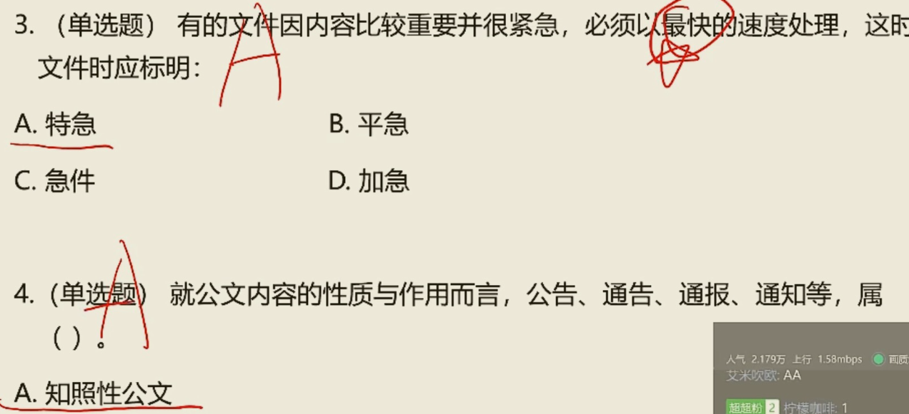

**议案**只能由**各级人民政府**行文，政府工作部门不能使用议案

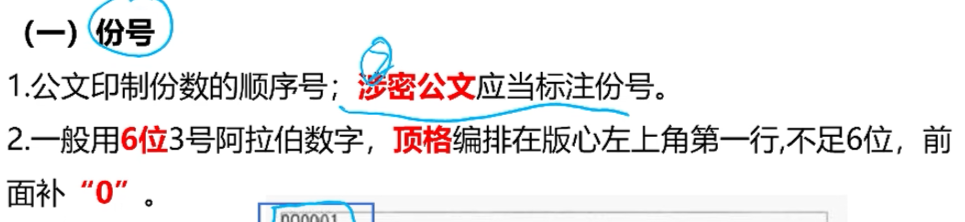

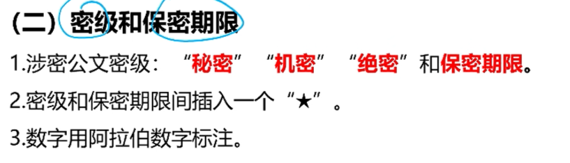

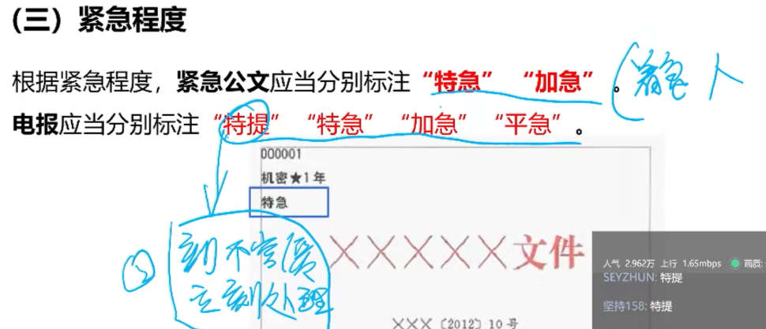

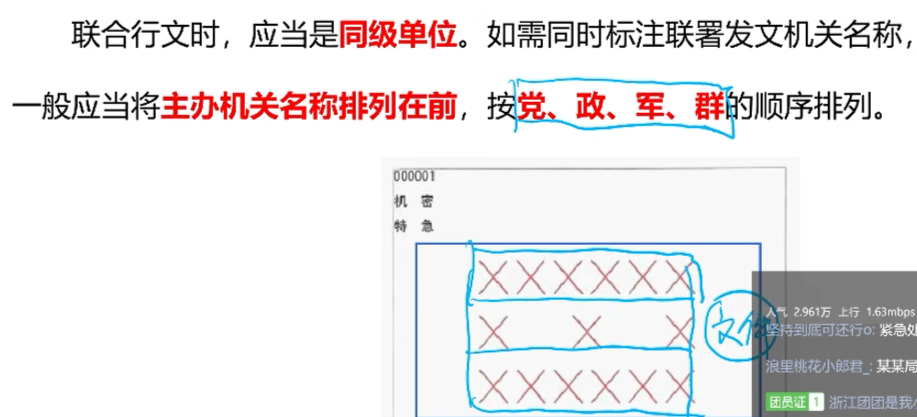

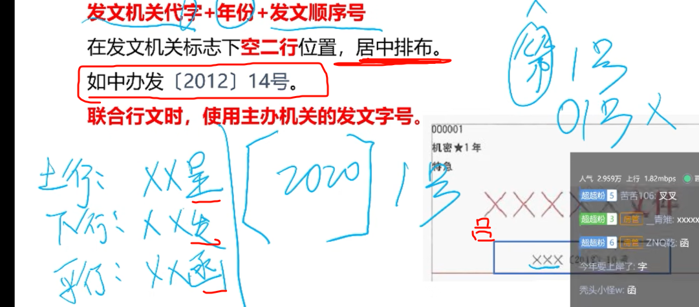

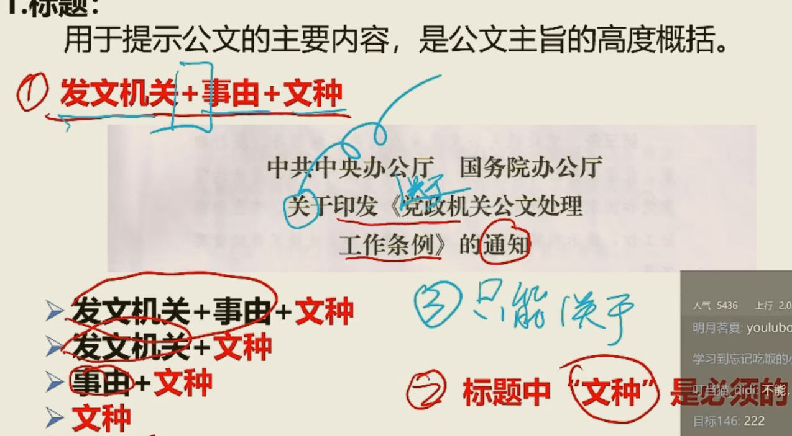

**发文机关（非必须）+事由（非必须）+文种（必须），只能有一个关于**

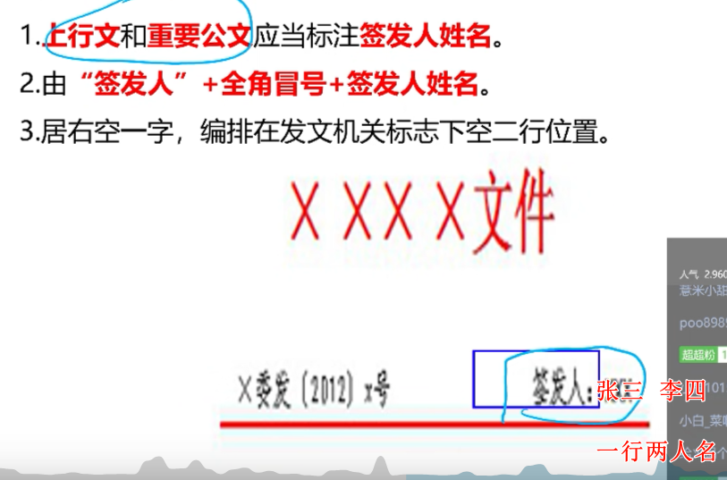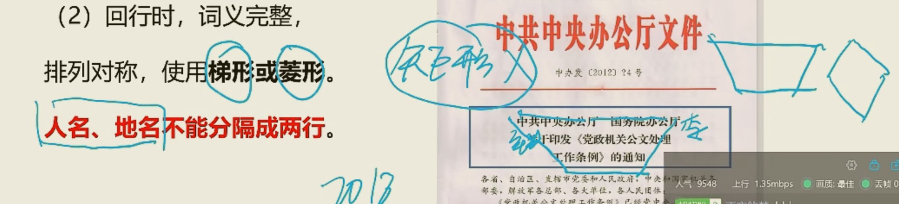

上行文和重要行文——标注签发人

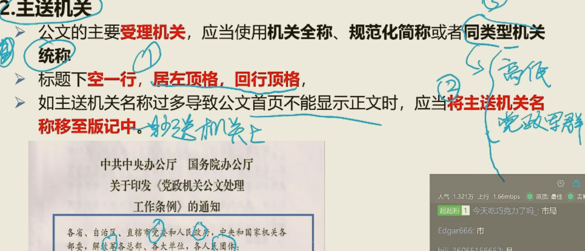

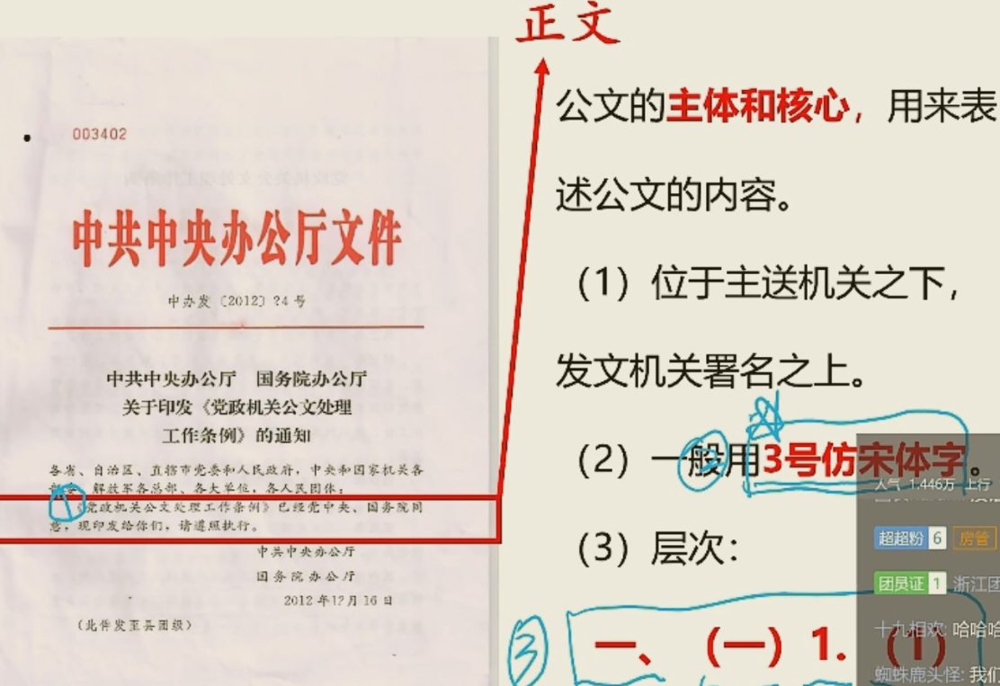

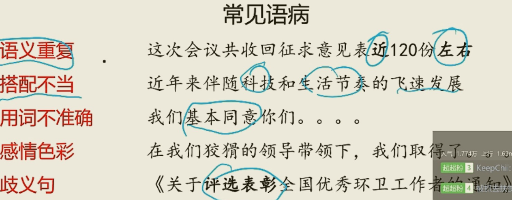

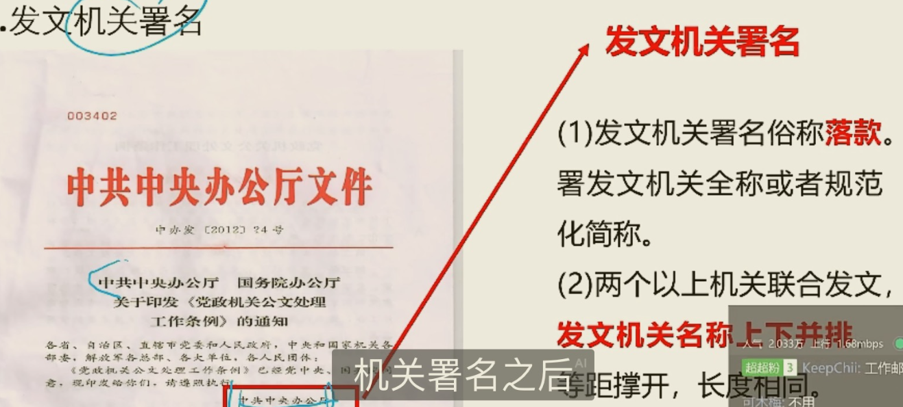

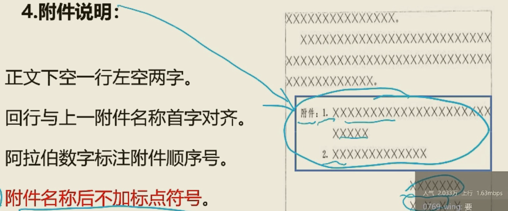

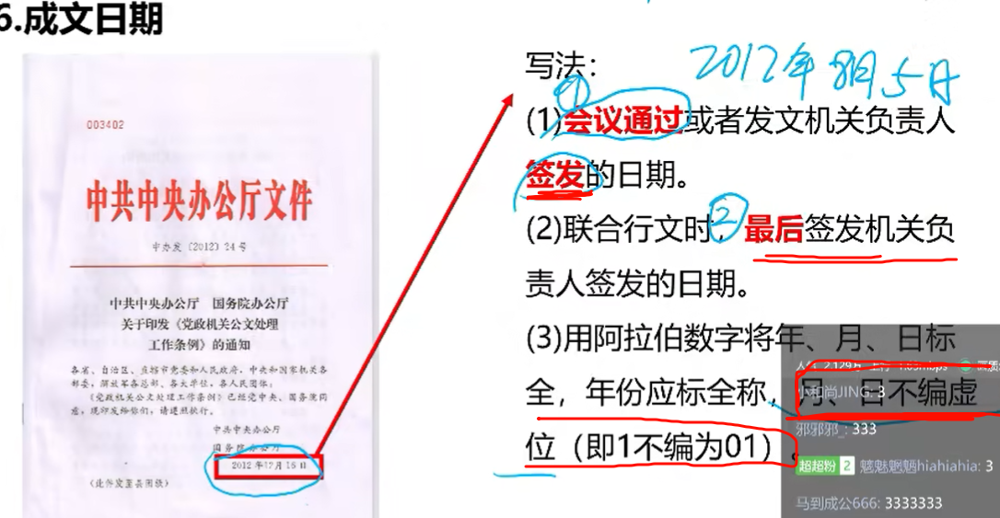

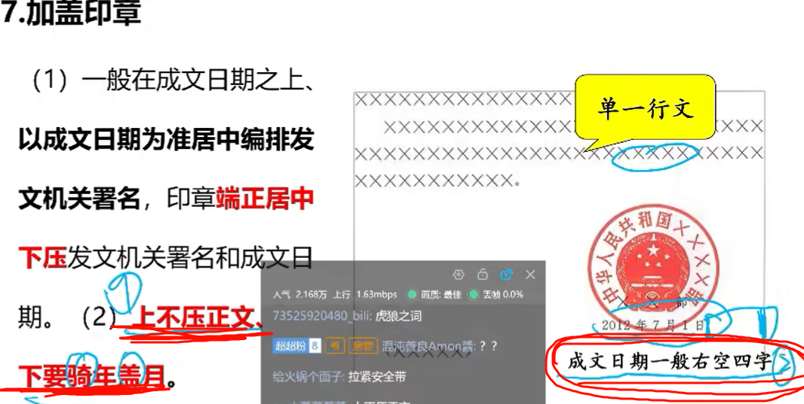

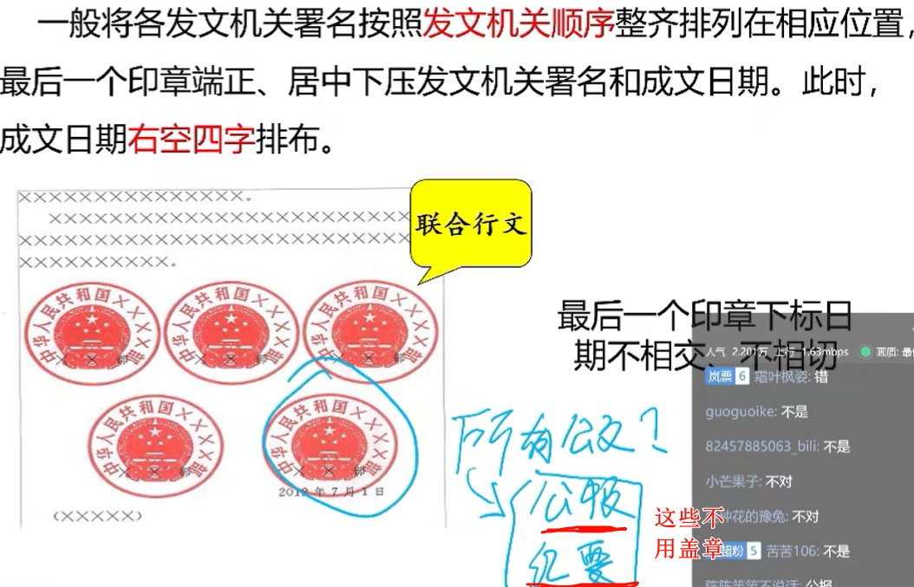

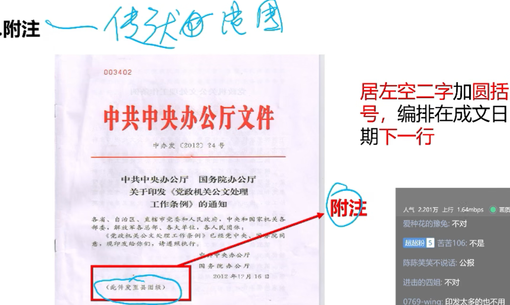

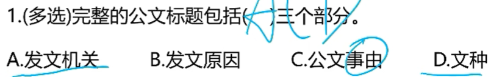

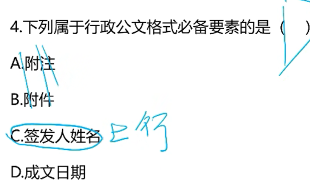

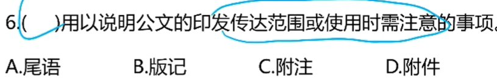

----

