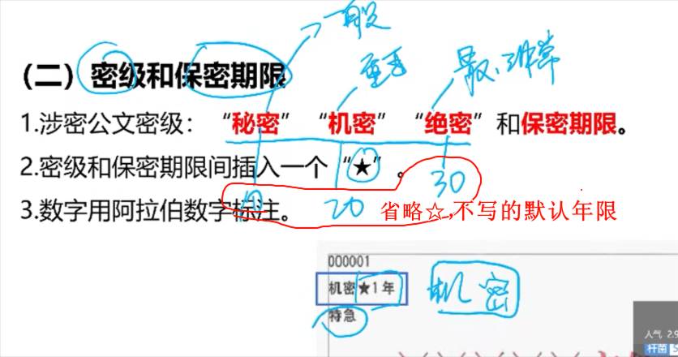
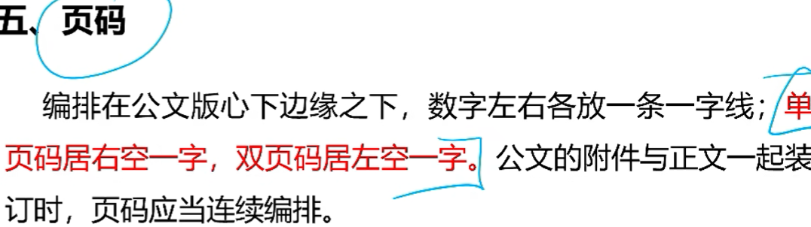

行文关系包括隶属关系、业务指导关系、平行关系、不相隶属关系。

G市人民政府与G市所在的省文物局之间属于平行关系。

**决定：奖惩有关单位或人员——劳模**

**命令：嘉奖有关单位和人员——抗洪，救火，缉毒**

**通报：表彰先进，批评错误——典型事件，教育**

 知照性公文：包括公告，通告，通报，通知等

可上可下可平行——意见

**使用频次最高——通知**

只用来奖不惩——命令

最有强制力的——命令

“特此请示，盼复”是“请示”公文的常用结尾。**不可用于“函”结尾**

用于同级用“函”结尾的：请研究函复为盼，特此函告，专此函达，请答复（某市人事局与市财政局是同级单位，两者不能用请示行文，要用函）

**议案**只能由**各级人民政府**行文，政府工作部门不能使用议案

**涉密公文标注份号**；六位3号阿拉伯数字，顶格左上角第一行，**不足6位补0，如000001**

**紧急公文**应当分别标注“特急”，“加急”，

**电报**应当分别标注“特提”（刻不容缓，立刻处理），“特急”，“加急”，“平急” 

**联合行文**时，应当是**同级单位**。如需同时标注联署发文机关名称，

一般应当将主办机关名称排列在前，按**党、政、军、群**的顺序排列。

如有“**文件**”二字，应当置于发文机关名称**右侧**，以联署发文机关名称为准上下居中排布。

发文机关代字+年份+发文顺序号

发文机关标志**下空两行**，居中，中办发〔2012〕2号——没有第，没有0开头，

上行——xx呈；下行——xx发；平行——xx函

**发文机关（非必须）+事由（非必须）+文种（必须），只能有一个关于**

**上行文和重要行文，要标注签发人姓名**

签发人+全角冒号+签发人姓名；签发人姓名一行两个人名；居右空一字，编排在发文机关标志**下空二行位置**（和发文机关代字一行）

标题：回行的时候词义完整，排序对称，梯形或菱形，不能用矩形，人名地名不能分两行；

**附注不可以标注数据、图表、图形**

行文方式指机关之间公文传递的形式，分为**逐级行文、多级行文、越级行文、直达行文、直接行文**等

具有**隶属或业务指导关系**的机关之间基本采**取逐级行文**的方式

#### 联合行文，作者应是同级机关

