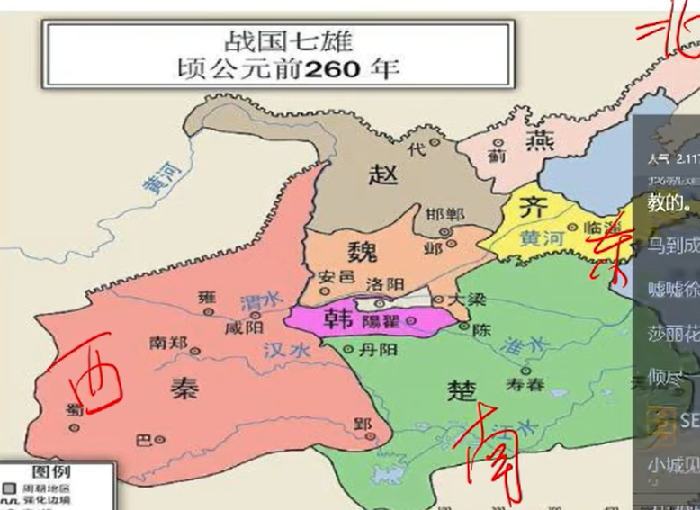
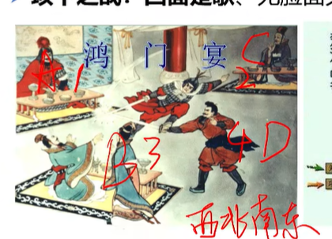
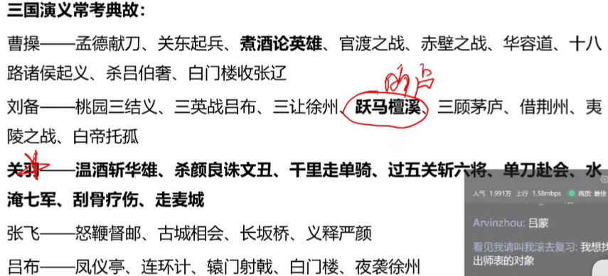
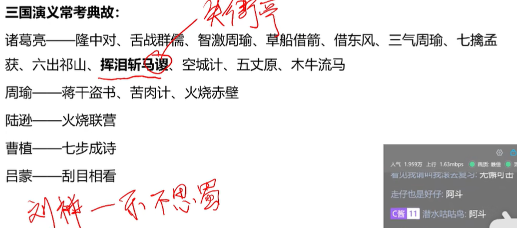
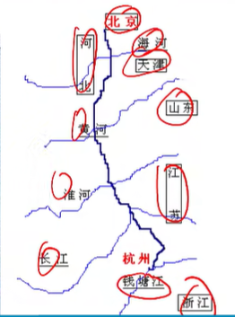

| 人             | 时间            |                              |
| -------------- | --------------- | ---------------------------- |
| 元谋人（云南   | 170万年前（最早 | 群居生活（原始人             |
| 蓝田人（陕西   | 80万年前        | 制造石器，群居生活（原始人   |
| 周口店人（北京 | 70-20万年前     | 使用天然火，群居生活（原始人 |
| 山顶洞人（北京 | 3万年           | 人工取火，血缘氏族，氏族公社 |

## 母系

河姆渡，浙江，水稻种植遗迹，长江流域农耕代表

半坡，陕西，主要粮食粟（谷子），黄河流域农耕代表

仰韶，黄河流域，河南陕西，

## 父系

大汶口，开始进入父系氏族，私有制，山东泰安

龙山，山东济南，黑陶为主要特征文化遗存

良渚，杭州，列入世界遗产名录，特色玉器

## 三皇五帝

燧人氏，钻木取火

伏羲氏，八卦，河书，洛书

神农氏（炎帝），制耒耜（leisi），种五谷，尝百草

女娲氏，

有巢氏，

农具：石斧（石器时代）耒耜（氏族公社）

五谷：稻/麻，麦，黍，菽， 稷

## 夏

禹建立第一个奴隶制国家，定都阳城（洛阳），从此世袭制代替禅让制

河南洛阳，大型绿松石龙，中国龙

## 商

定都，毫，后迁都殷（安阳）

亡国，牧野之战——临阵倒戈

青铜器：司母戊鼎，四羊方尊

甲骨文：汉字源头，甲骨文之父——王懿荣

### 内外服制度

封侯和伯

## 西周东周

### 西周

武王，定都镐京（西安）

#### 分封制

天子，诸侯，卿大夫，士

#### 宗法制

嫡长子继承

世卿世禄，嫡庶之辨，家族祖宗，大宗小宗，宗凝聚族

#### 礼乐制

周礼，等级

#### 井田制

（关于土地未实施）

#### 选官制度——世官制

六艺：礼（礼仪），乐（音乐），射（射箭），御（驾驭马车），数（算术），书（书写）

防人之口，甚于防川

西周灭亡：烽火戏诸侯

### 东周

幽王儿子周平王，迁都洛邑

九州：冀州，青州，徐州，扬州，兖州，荆州，豫州，梁州，雍州

情(青)绪(徐)扬(扬)，挤(冀)眼(兖)睛(荆)，欲(豫)良(梁)佣(雍)

## **春秋**五霸

####  

|   五霸   | 战争                                                         |
| :------: | ------------------------------------------------------------ |
|  晋文公  | 城濮之战 退避三舍(一舍三十里） 寒食节 秦晋之好（联姻） |
|  楚庄王  | 不鸣则已一鸣惊人 问鼎中原（称王称霸） 饮马黄河       |
| 吴王阁闾 | 伍子胥改革 任用孙武                                      |
| 越王勾践 | 卧薪尝胆                                                     |
|  齐桓公  | 任用管仲为相， 尊王囊夷， 葵丘之盟（取得霸王地位标志）， 管仲拜相，老马识途，风马牛不相及 管仲是中国历史上第一位杰出的**宰相**（**宰相最早指的是官吏统称**），“土农工商”最早出自管仲 |

沉鱼西施，落雁王昭君，闭月貂蝉，羞花杨玉环

春秋结束标志：田氏代齐（和三家分晋）（多选）

## 战国时期

各国变法

楚国吴起变法

魏国李悝变法

韩国申不害变法

### 秦国商鞅变法（在  ***秦孝公***   时期）{

废除井田制，重农抑商；

#### **军功授爵制替代之前的世官制；**

郡县制；

连坐法；（遭罪连锁反应）

制定户籍制度；

作法自毙；

立/徒木立信；

}

### 战国时期战争

|   名称   | 经过                                                         |
| :------: | :----------------------------------------------------------- |
| 长平之战 | 秦国白起（四大战神之一，王翦，李牧，廉颇）打赵国获胜进占长平； 纸上谈兵——赵括 |
| 桂陵之战 | 魏打赵，齐国田忌和孙膑运用围魏救赵                           |
| 马陵之战 | 魏打韩，齐国孙膑运用减灶之法/增兵减灶                        |
| 邯郸之战 | 窃符救赵，魏无忌听取侯赢之计，借魏王姬妾如窃得兵符，夺取魏国兵权，击败秦军，救援赵国 |

都城

|           排名 |       都城 | 现在所在地               |
| -------------: | ---------: | ------------------------ |
| 齐国（最东边） |       临淄 | 山东淄博                 |
| 楚国（最南边） |       郢都 | 湖北锦州？安徽寿县       |
| 燕国（最北边） |         蓟 | 北京？辽宁辽阳           |
|           韩国 |       新郑 | 河南新郑                 |
|           魏国 | 安邑，大梁 | 河南开封                 |
|           赵国 |       邯郸 | 河北邯郸                 |
| 秦国（最西边） | 栎阳，咸阳 | 陕西咸阳（西安的一个区） |

秦国先后灭掉韩赵魏楚燕齐（喊赵薇去演戏）

## **秦国**

前221-206年，第一个专制主义中央集权国家，第一个皇帝，定都咸阳

#### 沙丘之变——指鹿为马（赵高和胡亥）

### 重大举措：

政治：

####  皇帝制度——三公九卿制，（丞相（行政，全国政务），太尉（军权（虚，无）），御使大夫（监察））中央政府；地方实行郡县制

#### 监管制度——御使大夫

​	经济：统一货币（半两），统一单位（度（长度）、量（容积）、衡（重量））；

​	文化：焚书坑儒，以吏为师（与法有关的，比如李斯），以法为教，统一文字（小篆，李斯）（之后化简为隶书）

​	建筑：修筑长城，灵渠（长江水系，珠江水系）

### 灭亡：

大泽乡起义（陈胜吴广起义，第一次大规模农民起义，燕雀安知鸿鹄之志哉，王侯将相宁有种乎）

巨鹿之战——项羽破釜沉舟（项羽没有攻破咸阳）锦衣夜行，霸王别姬，作壁上观，沐猴而冠，偏向以少胜多

刘邦攻入咸阳，与民**约法三章**

鸿门宴（**西北南东**，**座位为尊**的顺序）

**垓下之战：四面楚歌**

## 西汉

前202-8

定都长安，汉高祖刘邦

#### 汉承秦制：皇帝制度，三公九卿制度，**封国制**（核心）（七国之乱，汉景帝，刘鼻），郡县制，实行推恩令，中央集权加强

**汉初三杰**

**韩信**（胯下之辱，多多益善，背水一战，明修栈道，暗度陈仓，成也萧何败萧何）

**萧何**（国士无双，萧规曹随（曹指的是曹参））

**张良**（运筹帷幄，明哲保身）（孺子可教）

#### 全盛

#### 政治：推恩令削夺诸侯权利

#### 汉代实行察举制，征召制，征辟制

思想：采用董仲舒（目不窥园）天人感应，君权神授，罢黜百家独尊儒术，设立太学

经济：盐铁官营（桑弘羊），统一五铢钱，财政集中中央

军事：北击匈奴（卫青，飞将，李广，霍去病（骠骑大将军，封狼居胥，匈奴未灭何以家为）），通西南夷（司马相如）

汉武帝：金屋藏娇，巫蛊之祸，思子台（思子宫）

-----------------汉文帝汉景帝----------------

#### **文景之治**——无为而治，轻徭薄赋，减轻刑罚

七国之乱——诛晁错，清君侧——吴王刘濞vs周亚夫（周亚夫军细柳营，清军严明）

### 对外关系

#### 陆上丝绸之路：

张骞出使西域，东起长安，张骞第一次出使西域是在公元前139年（古代史的第一个睁开眼看世界的中国人）

最南：大秦古罗马地区，最北：里海沿岸

输出：铁器，丝绸，养蚕，铸铁术，井渠法，造纸术

输入：**佛教**，葡萄，石榴，胡瓜（黄瓜），胡桃，良马

**西汉末年传入佛教**

#### 海上丝绸之路：

起于秦汉，兴于隋唐，盛于宋元，明初巅峰，之后衰落

番禺（广州）（明清后唯一对外开放的港口），登州（烟台），扬州，泉州（宋元东方第一大港），明州（宁波），刘家港（苏州太仓）（郑和下西洋）

#### 西域都护府

公元前60，汉宣帝设立，郑吉管理，新疆地区开始隶属中央管辖

#### 昆阳之战（以少胜多）

（绿林起义，赤眉起义），王莽vs刘秀

## 东汉

刘秀，定都洛阳，

#### **光武中兴**

#### 白马寺：

汉明帝时期建立，第一座管办寺院，有佛教的祖庭和释源之称

#### 班超，西域都护，投笔从戎

（班彪，班固（史学有关，没有打通西域），班昭）

## 三国

魏蜀吴顺序称帝

#### 官渡之战（以少胜多，夜袭乌巢，现河南郑州）

#### 赤壁之战（以少胜多，奠定三国鼎立，主要双方是周瑜和曹操）

#### 夷陵之战（猇亭之战，陆逊vs刘备，积极防御成功案例，以逸待劳，火烧连营）

## 西晋和东晋

265-316

司马炎废魏帝，建立西晋；

司马睿，在建康（南京 ）即位，东晋开始，晋元帝，王与马共天下

### 淝水之战：东晋打败前秦，以少胜多，（有苻坚，谢玄）

### 东山再起（谢安），风声鹤唳，草木皆兵，投鞭断流

#### 九品中正制：曹魏时期，陈群创立；

八王之乱：（ 东海王司马越胜利，）

五胡乱华（

### 南北朝
南朝——宋齐梁陈，建都建康；
北朝——北朝包括北魏、东魏、西魏、北齐和北周五朝；
北魏（鲜卑族）统一北方，北魏孝文帝改革，平均田和租调，从平城（大同）迁都洛阳，移风易俗，实行汉化制度

## 隋朝

定都长安，建员开皇，隋文帝，开皇之治，

#### 一衣带水(水是长江)

后庭花（陈叔宝，描述的是张丽华）

### 科举制 （持续时间最长，到1905） [人文等.md](..\人文\人文等.md) 

### 三省六部制

### 大运河

洛阳为中心，南到余杭（浙江杭州），北到涿郡（北京）

是世界上最早最大的运河。**元朝以后不会经过洛阳**

## 唐

**唐朝的第一位皇帝——李渊**，太原起兵，定都长安

### 三省六部制

#### 三省：尚书省（行政）中书省（决策）门下省（审核）

#### 六 部：吏（官吏任免考核）兵（军政）户（户籍土地赋税）刑（法律刑狱）礼（科举典章法度）工（工程建设）

#### 监管制度——门下省，三个院——台院，察院，殿院

### 唐太宗（李世民）——玄武门之变——贞观之治；

区分：水则载舟，水则覆舟——荀子；水能载舟，亦能覆舟——李世民；

房谋杜断，以铜为镜可以正衣冠；以古为镜可以知兴替；以人为镜可以明得失；

### 贞观遗风（武则天）

##### 开殿试，武举（ 糊名法，防作弊，宋朝启用），请君入瓮（来俊臣）

### 开元盛世（唐玄宗）

一骑红尘妃子笑，无人知是荔枝来（荔枝，从四川送来，

马嵬坡，长生殿，

口蜜腹剑——李林甫，

### 安史之乱（安禄山，史思明，节度使制）

郭子仪——醉打金枝

司空见惯——唐代大诗人刘禹锡有关，司空是古代官职

### 民族关系

唐太宗被西北，中亚少数民族称为“天可汗”；

贞观时期：**文成公主**入藏；

8世纪初，唐中宗时期，**金城公主**嫁给吐蕃赞布；

9世纪，吐蕃与唐会盟，**长庆会盟**

### 对外关系

玄奘取经，大唐西域记，天竺（印度）遣使唐朝送来郁金香，菩提树（经书存在大雁塔

鉴真东渡——鉴真和尚

日本遣唐使：参照汉字创造日文，阿倍仲麻吕

黄巢起义——待到秋来九月八，我花开后百花杀（菊花）冲天香阵透长安，满城尽带黄金甲

朱温灭唐；

## 两宋

北宋，960年，

赵匡胤，宋太祖，陈桥驿兵变——黄袍加身，定都开封

#### 独立机构检查制度——谏院

#### **杯酒释兵权**

##### 辽（契丹族，916，耶律阿保机），西夏（党项族，1038，李元昊），金（女真族，1115，完颜阿骨打），大理（段氏），吐蕃

女真族（金和清），鲜卑族（燕，北魏）

澶渊之盟——**北宋和辽**

靖康质变——**金国虏徽，钦二帝，灭亡北宋**

南宋：

赵构称帝，定都临安（杭州）， **直把杭州作汴州**

岳飞——郾城大捷，（满江红）

绍兴会议

崖山海战（被元朝压到广东）

### 政治制度————枢密院和三衙

经济

重心南移

北宋最早纸币——交子（成都商铺民间），后南方作为官方的

市舶司——对外贸易机关

### 改革（都没有成功）

#### 庆历新政

范仲淹——不以物喜不以己悲，先天下之忧而忧后天下之乐而乐

#### 王安石变法

##### 熙宁变法/熙丰变法，

内容：颁布农田水利法，均输法，青苗法，免役法/募役法，市易法，方田均税法，保甲法，将兵法

##### 王安石被列宁称为，中国十一世纪伟大的变革家

**赤手起家：文天祥**

## 元朝

1271-1368

铁木真，建立蒙古大汗，成吉思汗（成吉指的是大海）

其孙，忽必烈建立元朝，元世祖，定都大都（北京）

高丽（朝鲜，穷），琉球（日本，没过去），

### 行省制度，最早开始设立省级行政区——行中书省，代替原来的三省

宣政院——正式开始管理西藏（清朝是理藩院，葛厦是当时的政府，明朝的是乌思藏都指挥使司）

澎湖巡检司——开始管理澎湖和台湾

马可波罗（意大利，马可波罗游记）

泉州当时是世界第一大港

## 明

1368，朱元璋，农民起义，明太祖，定都南京，明成祖朱棣迁都北京

洪武之治，靖难之役，永乐盛世，郑和下西洋，土木堡之变，张居正变法， 戚继光抗倭

### 君主专制加强，废丞相，（明成祖时期）设内阁

设厂卫特务：锦衣卫，东厂，西厂

张居正变法 

#### 对外交流

郑和下西洋（1405-1433，十五世纪初）七次，

从刘家港到红海沿岸和非洲东海岸

明中后期，美洲的甘薯，玉米，马铃薯，烟草，辣椒，番茄，花生传入中国

郑成功收复台湾，戚继光抗倭，1553年，葡萄牙人在澳门暂住446年

闻一多——七子之歌

于谦——石灰吟

李自成灭明朝

## 清

1616努尔哈赤建立后金，1636**皇太极国号改为清**，改女真族为满族，1644，清军入关后，顺治帝第一个皇帝，定都北京城

努尔哈赤，皇太极，顺治，康熙，雍正，乾隆，嘉庆，道光，**咸丰**（最后一位拥有实权的皇帝），同治，光绪，溥仪

#### 皇帝顺序——努尔哈赤皇顺康，雍乾嘉道咸同光，清朝一共十二帝，末代宣统最悲伤

#### 康乾盛世

康熙 ，三藩之乱，吴三桂，尚可喜，耿精忠，

恸哭六军俱缟素，冲冠一怒为红颜。（六军指的是吴三桂的军队，红颜是吴三桂妻子）

六军不发无奈何，宛转蛾眉马前死（六军和杨贵妃有关）

台湾府

#### 雍正，设立军机处**（清朝军机处和文字狱，也是君主专制的顶峰）**

经济实行摊丁入亩，

乾隆，西藏实行金瓶掣签制度（在位时间最长的皇帝）

文字狱盛行

1683收复台湾，1684设立台湾府，属福建省

1689，和俄军签订平等尼布楚条约，也是中国与西方国家缔结的第一份国际条约

重农抑商，海禁政策

