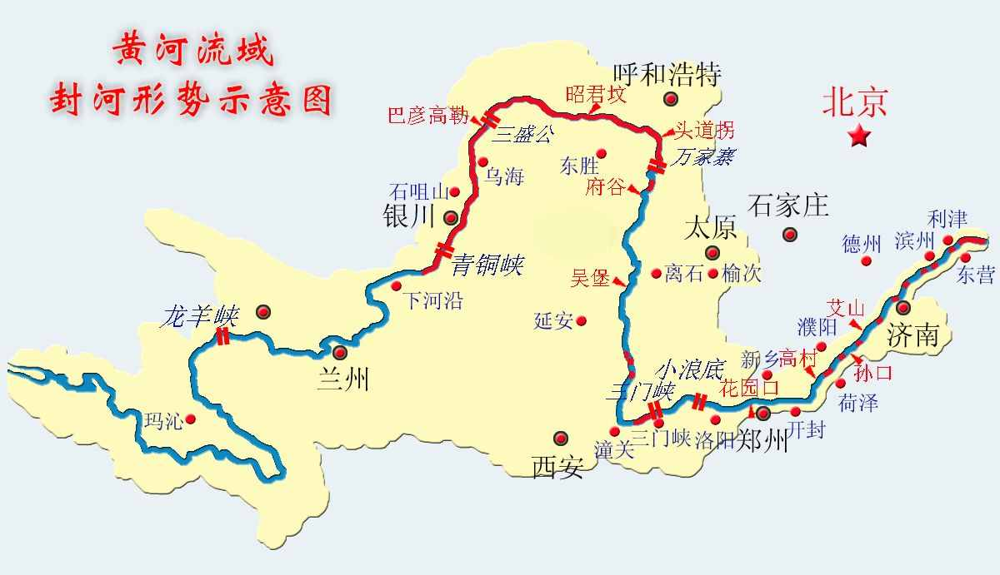
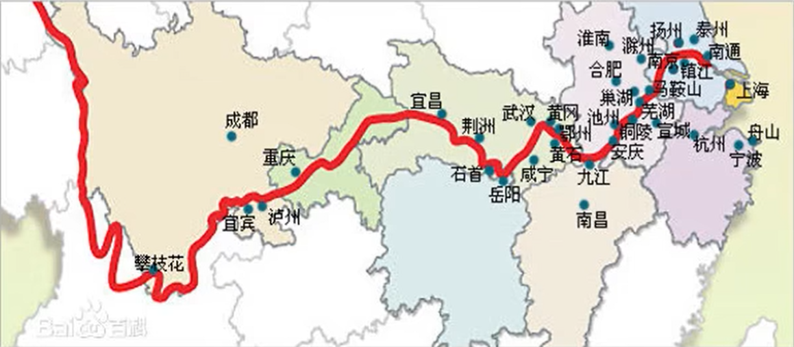

## 自然地理

### 天体

水星（最小，没有水，晨星），金星（启明星；和地球等行星转的方向不一样，逆向自转），地球，火星（有水，有大气），小行星带，《=（里面的行星都有固体）|| 木星（最大），土星（卫星最多，光环），天王星，海王星（最远），冥王星（矮行星，取消了）

### 太阳（金乌，白驹过隙）

质量99.86%，是气体构成

太阳能：氢转氦 核聚变

光 光球层——有黑子，最早记录黑子出自西汉《淮南子》记载“日中有踆乌”，《汉书五行志》，

色 色球层（有耀斑）

日 日珥层

#### 太阳风

破坏臭氧层，形成彗星，形成极光，干扰卫星通讯

#### 极光形成（大气，磁场，太阳风，三者缺一不可，发生在电离层）

天文单位：1.5亿公里

##### 太阳活动对地球影响

黑子和三个维度带的降水量有关系，电离层使得无线电短波受影响，产生磁暴现象（候鸟指南针等）

#### 日食——日全食，日环食，日偏食

月球在地球和太阳之间

只发生在农历初一，从西边开始

#### 日食过程：初亏，食既，食甚，生光，复圆

**最早记录日食出自尚书**

### 月球

有能源，氦3

#### 月食

只在农历十五左右（望是十五，既望是十六

望日；不会形成环食

**塑**（月初）=》**上弦月**（左缺口）=》**望**=》**下弦月**（右缺口）=》**晦**

**张衡最初解释了月食**

### 地球自转

#### 冬至是近日点

黄赤交角的出现（23度26分）使得南北半球四季相反

### 二十四节气

#### 夏至——太阳直射北回归线，北半球太阳高度角最大， 影子最短，白天时间最长；

#### 白露——北半球昼夜温差最大 ；

3月（赤道）=》6月（北回归线），9月（赤道），12月（南回归线）

##### 春雨惊春清谷天，夏满芒夏暑相连。秋处露秋寒霜降，冬雪雪冬小大寒。

立春， 雨水，惊蛰，春分，清明，谷雨

立夏，小满，芒种，夏至，小暑，大暑

立秋，处暑，白露，秋分，寒露，霜降

立冬，小雪，大雪，冬至，小寒，大寒 

### 大气 

从上往下

电离层+中间层（大气层）（极光）

臭氧层（紫外线）

平流层（飞机，高度越高，温度越高）

对流层（天气现象，高度越高，气温越低）

### 降水

#### 垂直降水——雨，雪，雹，雨凇（类似冻雨降落后形成冰，自然灾害）

对流雨（赤道全年下）锋面雨（梅雨，清明时节雨纷纷）地形雨（喜马拉雅的雨，持续很短）台风雨（广东那边）

水平降水——霜，露，雾，雾凇

雾和霾区别——水含量的区别

### 陆地

青藏高原（世界最高）巴西高原（世界最大）亚马逊平原（世界最大）刚果盆地（世界最大）

## 中国地理

23省，4直辖市，5自治区，2特别行政区

无寒带，大陆海岸线1.8w公里

#### 14个陆地邻国，6个海上邻国（泰国，柬埔寨不和我们相邻）

最东边——乌苏里江和黑龙江汇合的中心航道

最西边——帕米尔高原

最北边——漠河以北的黑龙江主航道中心线

最南边——曾母暗沙

四个海——渤海黄海东海南海 

新疆是接壤邻国最多的省，内蒙是相邻省份最多的省

三大岛——台湾岛，海南岛，崇明岛

##### 浙江省是岛屿分布最多的省

**一级阶梯——青藏高原，柴达木盆地**

**二级阶梯——除了一级三级的都是**

**三级阶梯——全是平原**

青藏高原——中国最大，海拔最高的高原，世界屋脊，第三极（南极北极第三个极），太阳能最丰富

内蒙古高原（第二大）

黄土高原（水土流失，沟壑纵横）

云贵高原（地无三尺平，天无三日晴，多发泥石流，喀斯特地貌，石林景观）

塔里木盆地（最大，塔里木河，我国最长的内流河，风蚀雅丹地貌）

#### 准噶尔盆地（额尔齐斯河，唯一流入北冰洋的河，风蚀地貌）

柴达木盆地（聚宝盆）

四川盆地（天府之国，紫色的土）

东北平原（最大的商品粮产区（松嫩地区优先），丹顶鹤——齐齐哈尔扎龙保护区）

华北平原（芦苇，长芦盐场）

长江中下游平原（纵横交错）

秦岭淮河——亚热带季风和温带分界线，800mm等降水量线，橘生淮南则为橘，生于淮北则为枳（外因重要性）

东部地区以以季风气候为主，西伯利亚风

山东六国的山——崤山

#### 黄河

发源巴颜喀拉山

##### 流域省份：青海，四川，甘肃，宁夏，（西夏定都兴庆（银川市区）），内蒙古，陕西，山西，河南，（东汉洛阳（洛阳），北宋开封（开封））山东9个省，注入渤海，没有经过河北

#### 长江

世界第三大河，青藏高原古拉山

##### 流域省份：青海、西藏、四川、云南、重庆、湖北、湖南、江西、安徽、江苏、上海等11个省，注入东海

### 湖泊

##### 淡水湖：鄱阳湖，洞庭湖，太湖，洪泽湖，巢湖，咸水湖：青海湖（面积最大的湖），奇林湖，纳木错湖（最高的湖），艾丁湖（最低的湖），长白山天池（最深的湖）

### 山

#### 五岳——东岳泰山（山东，会当凌绝顶一览众山小），西岳华山（陕西，谁将依天剑，削出逸天峰），南岳衡山（湖南），北岳恒山（山西），中越嵩山（河南）

#### 三山——安徽黄山（第一奇山），江西庐山，浙江雁荡山

#### 佛教四山——山西五台山（文殊）安徽九华山（地藏王）四川峨眉山（普贤）浙江普陀山（观音）

道教名山——湖北武当山，江西龙虎山，安徽齐云山，四川青城山（和都江堰有双遗）

喀斯特地貌——张家界，九寨沟，黄果树瀑布，桂林山水

丹霞地貌——武夷山，江西龙虎山，广东丹霞山

雅丹地貌——柴达木盆地

冰川地貌

## 世界地理

七分海洋，三分陆地

最小洲——大洋洲

海拔最高洲——南极洲 

面积最大人口最多——亚洲

四大洋——太平洋面积最大，大西洋第二，印度洋第三，北冰洋最小

亚欧分界线——乌拉尔山，乌拉尔河，里海。大高加索山，黑海，土耳其海峡

亚非分界线——苏伊士运河

美洲分界线——巴拿马运河

亚美分界线——白令海峡

欧非分界线——直布罗陀海峡

南美和南极分界线——德雷克海峡

亚洲有一个重要的——马六甲海峡

| 最               |            | 最                 |              |
| ---------------- | ---------- | ------------------ | ------------ |
| 最高的高原       | 青藏高原   | 最大的内海         | 地中海       |
| 最大的沙漠       | 撒哈拉沙漠 | **盐度最大的*湖*** | 死海         |
| 最大的岛屿       | 格陵兰岛   | 最深的淡水湖       | 贝加尔湖     |
| 最大的盆地       | 刚果盆地   | 最深的咸水湖       | 死海         |
| **最长的内流河** | 伏尔加河   | 面积最大的咸水湖   | 里海         |
| 最深的裂谷带     | 东非大裂谷 | 面积最大的淡水湖   | 苏必利尔湖   |
| 最大的半岛       | 阿拉伯半岛 |                    |              |
| 最高的山峰       | 珠穆朗玛峰 | 流经国家最多的河流 | 多瑙河       |
| 最大的高原       | 巴西高原   | 最深的海沟         | 马里亚纳海沟 |
| 最高的湖         | 西藏纳木错 | 最大的平原         | 亚马逊平原   |
| 盐度最大的海     | 红海       | **盐度最小的*海*** | 波罗的海     |
|                  |            | 最长的河           | 尼罗河       |

