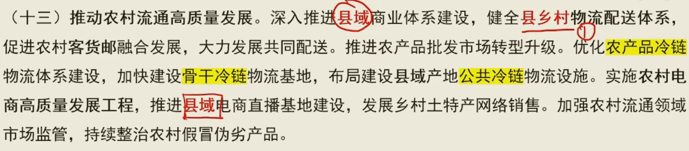

## 一号文件是十八大以来第十二个有关三农的文件，安全根基牢牢稳住18亿地红线

## 是新世纪来第二十一个有关三农的

学习运用**千万工程**经验为引领，对当前今后的三农工作进行系统部署

学习运用“**千村示范、万村整治”**工程经验有力有效推进乡村全面振兴

今后**5年**是美丽中国建设的重要时期

主要内容——守底线，促正兴，强保障

艰巨繁重的任务在——农村

促进农民**就业**增收，扩宽致富渠道

发展**智慧**农业，缩小城乡数字鸿沟

三农中心任务——农民增收

三农两个主题——**保供，增收**

三农问题核心——**农民**问题

做好大龄农民工就业扶持

启动“**车路云一体化”**试点

我国正在进入**中度**老龄化阶段；

全面实现的目标——农业强，农村美，农民富

两个底线——粮食 返贫

三个提升——产业 建设 治理

两个强化——科技和改革

我国粮食生产连续20联丰

三农：坚持和加强党的三农工作的全面领导，锚定建设**农业强国**的目标，以确保**国家粮食安全、确保不发生规模性返贫**为底线，来提升乡村**产业发展**水平、提升**乡村建设**水平、提升**乡村治理**水平，强化**科技**和**改革**双驱动（**利器在科技，关键在改革**）

**可持续**发展解决全球问题的金钥匙

千亿斤粮食产能提升，**稳粮食播种面积**，扩单产，重心在**大面积提高单产**，**去年13908.2亿斤**，**连续九年1.3万亿**，良田良种良机良法（姬发种田）

提高小麦最低收购价，合理确保稻谷最低收购价；玉米大豆稻谷三补贴；

**三大主粮全国覆盖（小麦，稻谷，玉米）**大豆有序扩面

省域内净增加量——规模上限；

三位一体“**数量，质量，生态**”的保护制度体系

确保粮食安全抓住**耕地（命根子），种子（芯片，关键）**两个要害；

我国人均粮食产量483.5万斤；

对确无人耕种的支持农村集体经济组织多途径**种好用好。**

鼓励**农村集体经济组织，新型农业经营主体（家庭农场，合作社，龙头企业，专业大户），农户**等**直接**参与高标准农田建设管护

**以地适地**和**以地适种**相结合。

加强气象灾害短期预警和中长期趋势研判。

构建现代农业经营体系。聚焦解决“谁来种地问题，以**小农户为基础、新型农业经营主体**为重点、**社会化服务**为支撑加快打造适应现代农业发展的高素质生产经营队伍。聚焦农业生产关键薄弱环节和小农户。

挖掘粮食机收减损潜力。

健全部门监管、行业自律、社会监督相结合的监管体系。

巩固提升三保障（教育，医疗，住房）和饮水安全保障。

持续加强产业和就业帮扶。巩固一批、升级一批、盘活一批、调整一批。

中央财政衔接推进乡村振兴补助资金用于产业发展的**比例保持总体稳定**。

加强帮扶项目资产管理，符合条件的纳入农村集体资产统一管理。

因地制宜、分类施策循序渐进、久久为功——体现了马哲的具体问题具体分析，特殊性

1

扶持政策与带动农户增收挂钩机制。

加强农民工职业技能培训。推广**订单，定向，定岗培训**模式。

农户依法自愿有偿

扎实堆进”**四好**农村路“建设（建好、管好、护好、运营好）；

2

----

