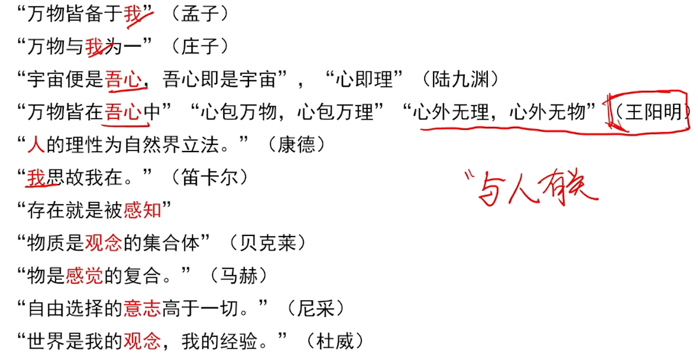
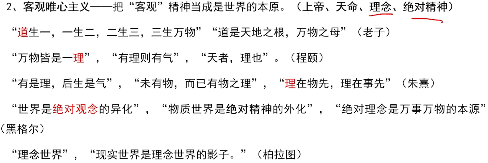

## 哲学概论

哲学 是系统化是是世界观与方法论的统一。

每个人都有世界观，都懂哲学（x）

**世界观决定方法论；方法论体现世界观**

马克思=》之后的哲学是科学，之前的哲学都不是科学

哲学研究世界发展最一般的规律，具体科学研究世界单一领域或方面的规律。

哲学是理论化统化的世界观；世界观是**自然界和人类社会**的根本观点；

马克思主义与具体科学是**一般与个别（不是整体和部分），共性与个性**的关系

哲学是整个世界的**最一般规律**为研究对象；具体科学是世界**某一领域的特殊规律**为研究对象，

具体科学是哲学的基础，**哲学给科学指导起指导作用**，哲学给具体科学提供了一般的世界观和方法论的指导，

### 哲学的基本问题

思维和存在的关系

其他一切哲学问题的前提基础；

划分唯物主义和唯心主义——第一性；非唯物——二元论；

唯心主义并非都是不可知论（黑格尔唯心但可知论）

**庸俗唯物主义不是唯物主义**（大脑分泌物 ）

哲学是有党性的；

### 唯物主义

#### 辩证唯物主义和历史唯物主义——马哲（马克思在哲学的两大发现）

科学的世界观和方法论，联系，全面，发展眼光

马克思的两大发现——剩余价值和唯物史观；

**彻底的唯物主义一元论**

#### 古朴唯物主义——金木水火土，气，水，阴阳

王充，顾炎武——古朴

#### 近代形而上学唯物主义——机械唯物主义

机械性，形而上学性（孤立，片面，静止），不彻底性（自然领域是唯物主义，历史观唯心主义；半截子唯物主义） 

分子，原子，电子，原子论

###  **唯心主义**
主观唯心主义（我，感觉，存在就是感知，心，人，经验，意志，别人说，）

客观唯心主义（理念（柏拉图），绝对观念（黑格尔），道，理，神，上帝， 天）

恩格斯第一次科学的对哲学的基本问题做出了完整概括和论证

五行，=》古朴思维和存在关系的

### 马克思主义组成部分：马克思主义哲学（基础），马克思主义政治*经济*学（主体内容），科学社会主义（目的归属）

出自恩格斯的反杜林论

#### 理论来源

英国古典政治经济学，

英国法国空想社会主义，（圣西门，傅立叶，欧文）

德国古典哲学（黑格尔（辩证法），费尔巴哈（唯物论），康德）直接理论来源

#### 三大发现——细胞学说、能量守恒定律、生物进化论，是马克思主义哲学产生的自然科学依据和前提

#### 马克思主义基本特征：***实践性***（首要的和基本特征，区分其他哲学的特征，独有特征），科学性（独有特征），革命性（前人批判），人民性，时代性，开放性，发展性，真理性

资本论——两大发现之一，剩余价值

德意志意识形态——历史唯物主义原理，共产主义者同盟，两大发现之一，剩余价值

## 物质性

**物质资料生产**是人类社会存在和发展的基础

**物质——客观实在性（列宁，不等于客观存在，是世界上一切物质的共性，不依赖于我们的感觉而存在，不以人的意识转移）**

物质是运动的物质，运动是**物质的运动**；运动离不开物质，不可割裂，物质和运动对立统一；

### 运动是物质的根本属性、存在形式 

离开运动谈物质=》犯了形而上学的错误

离开物质谈运动=》犯了唯心主义的错误

静止是认识事物的起点和基础；静止是运动特殊状态；

运动是绝对的，静止是相对的有条件的；动中有静，静中有动；

否认运动——形而上学的世界观，比如刻舟求剑

否认静止——会导致相对主义，诡辩论，方生方死

坐地日行八万里，巡天遥看一千河——运动的绝对性和静止的相对性的统一

一寸光阴一寸金，寸金难买寸光阴——时间的一维性

运动是物质的存在方式这是对运动的**辩证唯物主义理解**

## 意识

**物质决定意识**：**物质是第一性的**；**意识反作用于物质**；比如一切从实际出发

**意识是自然界长期发展的产物**；意识是社会历史的产物，劳动在意识的产生中起了决定性作用

**意识是人脑的机能；**

**意识是人脑对客观存在的主观映像。意识的内容是客观的，形式是主观的**

**正确的意识才能促进事物的发展**；**错误的意识是对客观存在的歪曲的反映**，正确的意识和错误的意识都来自**客观世界**。

意识活动的目的性，计划性；创造性；对客观世界的改造作用；对人体活动的控制；

要遵循客观规律（第一位，是前提）；**要通过实践活动才能改造客观事物**，要依赖一定的手段和条件；

**客观规律**——**尊重之，可认识，可利用；不可推翻，不可创造，不可颠覆**

主观能动性——对客观世界的反作用或能动作用

人工智能无法具有意识，是人脑功能的延伸；语言是物质，人工智能不能理解；

---

## 辩证法