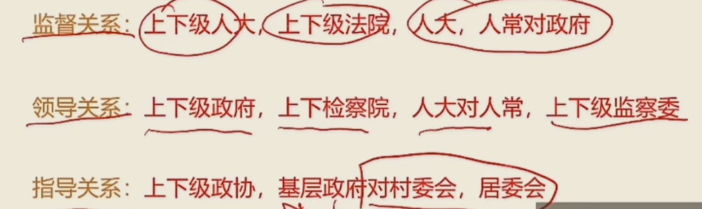

## 法

法律是统治阶级意志的体现

法律区别于道德规范、宗教规范等其他社会规范的首要之处在于法律是由国家创制并保障实施的行为规范。

中国第一部法律——**婚姻法**

法是**国家制定**或认可（原始社会没有法，法存在于阶级社会），国家强制力（国家强制力不是唯一保障手段，道德是）保障实施的，反映由统治阶级（人民）的**物质生活条件决定的**意志，以**权利和义务**为基础，以确认、保护和发展统治阶级所期望的社会关系和社会秩序为自的**行为规范体系**（**只规范行为，不规范思想**）

法的特征——规范性（对不特定主体反复适用），国家意志性（公共权力结构指定和认可的），普遍性（允许有差异），国家强制性，程序性，可诉性，稳定性

最主要的特征——靠国家强制力保证实施，以国家强制力为后盾的

法的作用——指引作用（对**本人**行为导向、引路作用），评价作用（对**他人**行为评价），预测作用（**相互间**的怎样行为和后果），教育作用（教育警示作用，**杀鸡儆猴**），强制作用（强制，针对**违法者**）

最根本的是**经济**决定法，法服务于经济；

政治主导法；执政党指导法；法更稳定；

法和道德相互渗透，相互促进，具有互补性；

违法不一定违反道德；违反道德不一定违法；**法是最低限度的道德**

法律主体分类——**主体**（自然人、组织（或是机构组织，或是法人、其他组织）、国家）**客体**（物、人身、智力、行为），**内容**（权利和义务）

**权利是首位的，承担履行义务是为了更好实现享有权利，为了保障权利的实现**；（权力是行政机关的事情）

权利和义务的存在，发展都必须以另一方的存在和发展为条件

法发布不生效；公布了就生效；公布之后，x月生效；原则上无溯及力（刑法有溯及力，从旧不从新）；

我国采取——以**属地主义为主**与属人主义和保护主义相结合；

特殊法和行政法不一致的时候，按照特殊法来；

法律——全国人大及其常委会

**行政法规**——国务院

地方性法规——**省级人大及其常委会**、设区的市、自治州的人大及其常委会

**部门规章——国务院组成部门、直属机构**

地方**政府**规章——省级人民**政府**,设区的市,自治州的人民**政府**

自治条例、单行条例——自治区、自治州、自治县人大，**自治人常不能制定**

### 效力

宪法>法律>行政法规>>地方性法规

宪法>法律>行政法规>部门规章

本级地方性法规>地方政府规章

xx部是国务院的下属（部门规章），如果国务院认为不合理，就用地方性法规；如果可以用部门规章，提醒全国人大常委会裁决地方性法规

部门规章之间、部门规章与地方政府规章之间对同一事项的规定不致时，国务院裁决

某省人民政府的**规章**与**国务院某部门**的规章不一致，由**国务院裁决**

### 体系

法律体系由法律部门组成，将一个国家全部现行法律规范分类组合为不同的法律部门而**形成的有机联系**的**统一整体**称之为**法的体系**

我国社会主义法律体系尚不完备；

当代中国的法律体系（不是中华法系（唐朝）），是以**宪法为核心**的**中国特色社会主义法律体系**，主要由7个法律部门构成，分别是：宪法及宪法相关法，民商法，行政法，经济法社会法，刑法，诉讼与非诉讼程序法。

当代中国法的渊源主要为以**宪法为核心**的各种制定法

### 执法

**国家行政主体及其公职入员**依法行使管理职权、履行职责、实施法律的活动

执法是以国家的名义对社会进行**全面管理**，具有国家权威性

**执法的主体**是国家**行政主体及其公职人员**

执法具有国家**强制性**

执法具有**主动性和单方面性**

### 守法——是更全面，也有要遵循程序要求的，有被动性和主动性

### 法律制裁分为民事制裁、行政制裁、刑事制裁和违宪制裁

某法官审理案件——司法环节；某市政府制定政府规章——立法环节；

某公司经理依据法律为其员工办理劳动保险——守法环节；某交通警察指挥交通——（行政）执法环节；

国家检查机关和国家审判机关都是司法机关；国家权力机关是人大的；

法的实施——执法守法司法，没有立法；

## 宪法

国旗，国歌，国徽，首都

法律效力和一般条文相同

我国宪法无附则

在资本主义国家中，英国是最早实行宪政的国家

#### 世界上第一部成文宪法一一1787年美国宪法

世界上第一部社会主义宪法—1918年《苏俄宪法》

旧中国:《中华民国临时约法》是中国历史上**惟一的一部资产阶级共和国性质的宪法性文件**。

新中国：一个宪法性文件：**《中国人民政治协商会议共同纲领》**，1949年起到**临时宪法**的作用

四部宪法：1954年宪法（**第一部社会主义性质的宪法**）、1975年宪法，1978年宪法，1982年宪法（现行宪法），对现在的宪法有五次修改

2018宪法修正了

1. “在马克思列宁主义、毛泽东思想、邓小平理论、‘三个代表’重要思想、**科学发展观、习近平新时代中国特色社会主义思想**指引下”
2. 在“自力更生，艰苦奋斗”前增写“贯彻新发展理念”；
3. 把我国建设称为**富强民主文明和谐美丽**的社会主义现代化强国，实现中华民族伟大复兴
4. 在长期的革命，建设，**改革**过程中
5. 全体社会主义劳动者，社会主义事业的建设者，拥护社会主义的爱国者，拥护祖国统一和**致力于中华民族伟大复兴的爱国者**
6. “**平等团结互助和谐**的社会主义民族关系已经确立，并将继续加强。”
7. 中国革命，建设，**改革**的成就...
8. ...平等互利、和平共处的五项原则，**坚持和平发展道路，坚持互利共赢开放战略**，发展同各国的外交关系和经济、文化交流，**推动构建人类命运共同体**；坚持反对帝国主义、霸权主义、殖民主义，...
9. 社会主义制度是中华人民共和国的根本制度，**中国共产党领导是中国特色社会主义最本质的特征**。禁止任何组织或者个人破坏社会主义制度。
10. 维护和发展各民族的**平等团结互助和谐**关系
11. 国家倡导社会主义核心价值观，提倡爱国，爱人民，爱劳动，...

宪法宣誓仪式：根据情况，可以采敢**单独宣誓或者集体宣誓**的形式。宣誓场所应当庄重、严肃，悬挂中华人民共和国国旗或者国徽。宣誓仪式应当**奏唱中华人民共和国国歌。**

国体即国家性质我国宪法规定：中华人民共和国是**工人阶级**领导的，以**工农联盟为基础**的**人民民主专政**的社会主义国家。公民范围大包括人民（和敌人）

1.中国共产党领导的多党合作制度

（1）**多党合作不是多党制**，**共产党是执政党**，民主党派不是在野党，而是**参政党**。

（2） 坚持中国共产党的领导、坚持四项基本原则是多党合作的**政治基础**

（3）“长期共存、互相监督、肝胆相照、荣辱与共”是多党合作的**基本方针**

（4）共产党对民主党派的领导是**政治领导**，即政治原则、政治方向和重大方针政策的领导。

现代国家的主要类型分为单一国、复合国。复合国目前有联邦和邦联两种形式

四项基本原则：一、必须坚持社会主义道路；二、必须坚持人民民主专政；三、必须坚持共产党的领导；四、必须坚持马列主义、毛泽东思想。

**八大民主党派**：中国国民党革命委员会，中国农工民主党，中国民主同盟，中国致公党，中国民主建国会，九三学社，中国民主促进会，台湾民主自治同盟

**中国人民政治协商会议**——爱国统一战线组织形式**

**政协职务/任务**——**政治协商，民主监督，参政议政**

**我国政体、国家的根本政治制度——人民代表大会制度**

具有统领地位——**党的领导**制度

我党的最大政治优势——密切联系群众

### 民族区域自治制度

自治区，州，县，民族乡不是

自治区，州，县的人民代表大会和人民政府属于自治机关；

经国务院批准自治机关可组织**公安部队；（军队不行）**

自治权——制定自治条例和单行条例权——**自治区人大制定自治条例和单行条例，人大常委会不能指定**

### 基层群众自治组织

基层群众自治组织包括**村委会与居委会**，二者**不属于国家机构**，基层政府指导，支持，帮助，

村民委员会的性质——**基层群众性自治组织**

群众性自治组织的**任期5年**

## 选举制度

我国实行直接选举的范围包括

县乡两级的直接选出，双过半原则（＞50%）

1. 不设区的市和市辖区的人民代表大会代表

2. 县、自治县的人民代表大会代表

3. 乡、民族乡、镇的人民代表大会代表
4. 设区的市的人民代表大会代表不行，属于市，要间接选出

我国农村和城市每一名全国人大代表的人口数比例1:1

## 公民基本权利

**平等权**，司法平等，守法平等

**政治权利自由**，选举权和被选举权，既是公民的最基本的民主权利，是公民参与管理国家和社会的基础和标志，**政治自由，包括言论出版、集会、结社、游行、示威的自由，没有罢工**（可以被剥夺）

**监督权**，监督权包括批评、建议权，控告、检举、申诉权

**取得赔偿权**

**生命权**

**人身自由权**

人格尊严不受侵犯

公民的住宅权不受侵犯。禁止非法搜查或者非法侵入公民的住宅。

通信自由和通信秘密。除因国家安全或者追查刑事犯罪的需要，由公安机关或检察机关依照法律规定，

**受教育权和劳动权，既是权利又是义务，只有劳动者有休息的权利（休息权），没有带薪休假的权利**

获得物质帮助权公民在年老、疾病或者丧失劳动能力的情况下**（自然灾害不行）**，有从国家和社会获得物质帮助的权利。

文化权利和自由。公民有进行科学研究，文学艺术创作和其他文化活动的自由，**没有出版权**，被剥夺政治权利的公民不再享有出版著作的自由

被剥夺政治权利的公民**享有**科学研究的自由，被剥夺政治权利的公民**享有**艺术创作的自由，**被剥夺政治权利的公民享有宗教信仰的自由**

## 全国人大

1. **修改宪法**，**监督宪法的实施**，
3. **制定和修改基本法律**
4. **选举主席和副主席**，
5. 主席**提名**，决定**国务院总理**；
6. **国务院总理**提名，决定国务院副总理、国务委员、**各部部长**、各委员会主任，
7. 选举中央军事委员会主席；
8. 选举**最高人民法院院长**
9. 选举**最高人民检察院检察长**
10. 选举**国家监察委员会主任**
11. **审查和批准**国民经济和社会发展计划和**计划执行情况的报告**
12. **审查和批准国家的预算和预算**执行情况的报告
13. **改变或者撤销全国人民代表大会常务委员会**不适当的决定
14. 批准**省、自治区和直辖市**的建置（乡和乡村归省政府管，中间的全部给国务院管）
15. 决定**特别行政区**的设立及其制度
16. **决定战争和和平的问题**
17. 应当由最高国家权力机关行使的其他职权

## 全国人大常务委员会

**全国人大常委会**是全国人民代表大会的**常设机关**，在**闭会期间行使最高国家权力的机关**。全国人大常委会与全国人大是隶属关系

常委会的组成人员不得担任**国家行政机关、监察机关、审判机关和检察机关**的职务，**可以在军队担任职务**

人大代表可以担任上面的职务↑

全国人大常委会的任期与全国人大相同，即5年。

委员长、副委员长连续任职不得超过两届

1. **解释宪法，监督宪法的实施**。（人常和人大都可以）
2. **制定和修改基本法律**
3. 解释法律
4. **审查批准**国民经济发展计划和国家预算
5. **监督国务院**等工作
6. **撤销（不能改变）**宪法，法律的行政法规，决定和命令
7. **撤销（不能改变）**地方性法规和决议
8. **国务院总理提名**，**决定各部部长**，委员会主任等
9. **决定外国的条约**重要协定的**批准和废除**
10. 根据**最高人民法院院长的提请**，任免最高人民法院副院长、审判员、审判委员会委员和军事法院院长

## 权力机关

地方各级人民代表大会及常委会

县级以上人民代表大会设立常务委员会，都是任期五年；

**乡镇的人大不设人大常务**，任期五年

## 国家主席

年满45岁可以；

任期五年；

国家元首（包括主席和副主席）

**代表国家**，进行国事活动

**代美国家**，接受外国使节

根据**全国人大常委会的决定**，**宣布**批准或废除条约和重要协定

公布法律，**发布**命令

**发布**特救令、**宣布**进入紧急状态等

由国家主席**宣布**国务院总理，国务委员，各部部长等的任职或免职，

## 国务院

1. 根据宪法和法律，**规定行政措施，制定行政法规，发布决定和命令**
2. **改变或者撤销**各部、各各委员会发布的不适当的命令、指示等
3. **改变或者撤销**地方各级国家行政机关的不适当的决定和命令
4. 批准**省、自治区、直辖市**的区域划分，批准**自治州、县、自治县、市**的建置和区域划分
5. **领导管理国防建设事业，没有国防**
6. 决定省，自治区，直辖市的范围内部分地区进入紧急状态（如武汉疫情）
7. 领导管理....
8. **编制执行**国民经济和社会发展计划和国家预算

#### 街道办是派出机关，是行政管理机构

## 中央军事委员会

**是全国武装力量的最高领导机关**

中央军委每届任期同全国人大每届任期相同即为期5年，没有届数限制

中央军委实行主席负责制

## 人民法院

人民法院是我国的审判机关

全国设立最高人民法院、**地方各级人民法院**、专门人民法院。

领导体制——监督关系

四级两审终审制

## 司法机关

司法机关是**行使司法权**的国家机关，是国家机构的基本组成部分，是依法成立的行使相关国家职权的司法组织。包括**法院、检察院**及有关功能部门。

在中国，司法机关指**人民法院、人民检察院**两大类。

领导体制——**双重从属制**

**人民检察院**依法独立行使检察权，是**国家的法律监督机关**

**司法厅、公安局属于行政机关**

## 监察委员会

最高监察机关

国际监察委员会主任连续任职不得超过两届

国家监察委员会**对人大和人大常务委员会负责**。

监察委员会依照法律规定**独立**行使监察权，不受行政机关、社会团体和个人干涉。

## 刑法

**罪型法定原则**（法无明文规定不为罪，法无明文规定不处罚）

**刑法面前人人平等原则**

**罪责刑相适应原则**（轻罪轻罚，重罪重罚）**罪刑相当**

**属地管辖原则（属地管辖权）**——凡在中华人民共和国领域内犯罪的（除了特别规定的以外），海陆空，驻外使领馆，船舶，飞机火车；行为地或是结果地，都适用刑法

保护管辖原则（保护管辖权）外国人对我国公民犯罪，

普遍管辖原则（普遍管辖权）（恐怖，贩毒，贩奴，特有的罪）

属人管辖原则（属人管辖权）人在外国犯罪，也要用刑法

### 刑法时间效力

从旧兼轻原则——优先轻再选旧

97——判处10年（x），判处5年（对），判处10年（x）

79——判处5年（对），判处10年（x），判处10年（对）

### 犯罪

特征——社会危害性、刑事违法性、应受惩罚性

任何一种犯罪的成立都必须具备四个方面的构成要件，**犯罪主体**，**犯罪主观方面**、**犯罪客体**和**犯罪客观方面**。

#### 单位犯罪

单位犯罪的主体包括公司、企业、事业单位、机关、团体

必须有为本单位谋取非法利益的故意，并且做出犯罪决定的是单位集体或其负责人

单位犯罪的，对单位判处罚金，**直接负责的主管人员**和其他**直接责任**人员判处**刑罚**（双罚制），不是直接负责人就不处罚法定代表人

双罚为主，单罚为辅；

单罚制：一般只处罚个人。

#### 自然人

**不满14岁**，实施任何行为，**不构成犯罪**

12-14岁的，**故意杀人，故意伤害罪，致人死亡**或**特别残忍手段致人重伤残疾**，要经过**最高人民检察院核准追诉的，负刑事责任**；

14周岁——16周岁的人，**故意**杀人、故意伤害致人重伤或者死亡、强奸、抢劫、贩卖毒品、放火、爆炸、投毒，投放危险物质的，负刑事责任。

**但是，过失杀人，绑架，不是故意杀死人，盗窃，种植毒品，走私毒品，吸毒，偷渡，都不负刑事责任**

14-18岁，从轻减轻处罚；不满16不负刑事责任的，必要的时候可以由**专门矫治教育**，已满75岁的，不适用死刑；故意犯罪，可以从轻处罚；过失，**要**从轻处罚；

**精神病，完全不能控制自己或不能辨认的，不负刑事责任；**

间歇性的正常的时候犯罪，要负刑事责任；

没有完全丧失辨认或控制自己行为的精神病人，又聋又哑的人或者盲人犯罪，负刑事责任，**可以**从轻处罚；

醉酒的人，负刑事责任，不加刑不减刑；

又聋又哑的人或者盲人犯罪，负刑事责任，**可以**从轻或免除处罚；

14-18，75以上老人过失犯罪，从轻、减轻处罚；

75以上老人故意犯罪，半疯，**可以**从轻、减轻处罚；

#### 犯罪主观方面

犯罪目的达到了就是犯罪既遂；没达到就是犯罪未遂；

以下情况不属于共同犯罪

1. 共同**过失犯罪**行为
2. .一有故意，**一方过失的犯罪**行为
3. 实施犯罪时**故意内容不同**
4. 同时犯偶遇
5. 超出共同故意之外的犯罪
6. 事前无通谋的事后帮助行为
7. 间接正犯；让一个不知情的人去做

交通肇事，附近所有人**指使肇事人逃逸**，得不到求助死亡的，是共犯；

从犯要从轻处罚

### 刑罚

主刑，附加刑；

主刑不能附加适用；一个罪一个主刑，不能有两个以上的主刑；

没有剥夺政治权利的犯罪分子，可以行使选举权等政治权利

管制——**限制3月以上2年以下，数罪并罚不能超过3年**；**限制自由**；**社区矫正机关**；不是关押；关押折抵1:2（可以和拘役和有期徒刑折抵）；

拘役——参加劳动可以发报酬，每月回家1-2天；**限制1个月以上6个月以下，数罪并罚不能超过1年**；**剥夺自由**；**公安机关（看守所）**；就近关押；关押折抵1:2（可以和拘役和有期徒刑折抵）；最低减刑不能少于一半

有期徒刑——强制劳动改造，**6个月以上，15年以下**，刑期总和**不满35年的，最高不超过20年**；刑期总和**超过35年的，最高不超过25年**；剥夺自由；剩余3个月以下的，看守所代执行；未成年犯在犯管教所执行刑罚；是关押；关押折抵1:1（可以和有期徒刑折抵）；**可以假释**；最低减刑不能少于一半

无期徒刑——强制劳动改造，**可以假释；**剥夺自由；是关押；最低减刑不能少于13年

死刑——无偿劳动，死缓立功2年期满后=》25年有期徒刑；死刑立即执行的=》剥夺生命，在法院执行；是关押；

#### 死刑立即执行

未满18岁的（17岁犯罪，19岁被抓，不能被执行死刑；

怀孕的妇女（关押到执行的过程中，流产，坐月子，都不能被执行死刑；

年满75岁人（特别情况除外；74岁犯罪，75岁被抓，不能被执行死刑；

立即执行=》最高人民法院判决核准；**死刑缓期两年执行的=》高级人民法院核准**；

没有故意犯罪的两年满后=》减为无期徒刑；死缓立功2年期满后=》25年有期徒刑

附加刑（从刑），可以独立适用，可以附加适用

罚金（不等于罚款，罚款是行政处罚），剥夺政治权利，没收财产，外国人驱逐出境

### 剥夺政治权利

主要涉及以下权利：

选举权和被选举权；

言论、出版（可以创作）、集会、结社游行、示威的权利，迫任国家机关职务的权利;

任国有公司、企业、事业单位和人民团体**领导**职务的权利。

**危害国家安全的，死刑，无期徒刑，必须剥夺政治权利**；其他可以剥夺；

有期徒刑，拘役=》剥夺期限1-5年；

死刑，无期徒刑减为无期徒刑的=》3-10年；

管制=》3月以上-2年以下，不超过3年；

### 累犯

一般累犯：

5年内，前罪与后罪都**必须是故意犯罪**。

犯前罪时必须**年满18周岁**

前罪被判处**有期徒刑以上**刑罚，后罪应当判处**有期徒刑以上**刑罚。

累犯应当从重处罚，**不得缓刑**和假释；可以减刑；

特殊累犯：

不受时间限制，前罪后罪都是危害国家安全，恐怖活动，黑社会组织的犯罪；

在假释考验期内再犯新罪的，不是累犯

### 自首

一般自首——犯罪以后自动投案（未被司法机关发现），向**公安机关，人民检察院或者人民法院(没有监察局)**投案；亲友劝去也算；犯罪嫌疑人自动投案后又逃跑的不能认定为自首；一审前

犯罪以后自动投案,必须如实供述自己的罪行，才是自首。

去自首的路上被抓算不算自首，视情况而定

特别自首——如实供述司法机关**尚未掌握**的本人**其他罪行（其他种类的罪行）**的行为；**如果是被抓了**，**供述了之前相同类型的罪行的行为，是坦白，不属于自首**

### 缓刑

死缓不是缓刑；

拘役（2月以上1年以下考验期）或3年以下有期徒刑（1年以上5年以下考验期）的，没有管制；

未成年，已满75岁的人，孕妇妇女，犯罪轻的，要缓刑；累犯，犯罪集团首要分子——不能缓刑

限制加重原则——针对判处有期徒刑、拘役和管制的，应当在总和刑期以下，**数刑中最高刑期以上**，酌情决定执行的刑期，并规定执行刑期的最高限度。

比如8年和12年的罪，要判处12年以上；

**附加刑仍需执行**；有有期徒刑，拘役，管制的，有期徒刑和拘役执行完，**管制仍需执行**

**缓刑期满后，重新犯罪的，不算累犯**

### 减刑

**执行机关**向**中级以上人民法院**提出减刑建议书

### 假释

执行原判刑期一半以上，才能假释

累犯，以及因故意杀人、强奸，抢劫、绑架、放火、爆炸，投放危险物品或有组织的**暴力性犯罪**且被**判处10年以上或无期徒刑**的，**减刑**的，不能假释；

### 立功

主动揭发

### 追诉

从犯罪之日开始计算

不再追诉的——不满5年有期徒刑的，超过5年；五年以上不满十年有期徒刑的，经过十年;十年以上，经过十五年；无期徒刑死刑的，经过二十年，二十年后必须追诉的，到最高人民检察院核准； 

如果立案侦查或受理案件了，就不受追诉期限限制；

追诉期内又犯罪的，从后面犯罪的日子开始重新计算

**国家司法机关的正常活动以及国家司法机关的威信**是**徇私枉法罪**侵犯的客体。

### 罪名

| 行为                                                         | 罪名                             |
| ------------------------------------------------------------ | -------------------------------- |
| 在新冠肺炎疫情防控期间，从事传染病防治的政府卫生行政部门的工作人员严重不负责任，导致传染病传播或者流行 | 传染病防治失职罪                 |
| 以暴力、威胁方法阻碍国家机关工作人员依法执行职务的           | 妨碍公务罪                       |
| 引起甲类传染病传播或者有传播严重危险的                       | 妨害传染病防治罪                 |
| 以暴力或者其他方法公然侮辱他人或者捏造事实诽谤他人           | 侮辱罪；诽谤罪                   |
| 防卫过当是指正当防卫行为超越了法律规定的防卫尺度，发生在正当防卫过程中，由于正当防卫并未发生，因此，李某的行为也不构成防卫过当=》却打死了人 | 事先防卫=》故意伤害罪            |
| **国家工作人员和国家机关事业单位等**委托管理、经营国有财产的人员非法占有公共财务；公务活动给予的贵重礼品不上交的 | 贪污罪                           |
| 国家工作人员利用职务上的便利，索取他人财物，只要收了钱就是   | 受贿罪（没有索贿罪）             |
| 国家工作人员利用职务上的便利，挪用公款归个人使用，数额较大进行营利活动；数额较大3个月不还的；      | 挪用公款罪（私企的是挪用资金罪） |
| 追逐竞驶，情节恶劣；醉驾**（毒驾不属于）**；严重超过额定成员载客、或严重超速的；违反危险化学品运输； | 危险驾驶罪                       |
| 抢夺方向盘、变速杆等操纵装置，殴打、拉拽驾驶人员，或者有其他妨害安全驾驶行为，危害公共安全 | 妨害安全驾驶罪                   |
| 不履行或者不认真履行职责                                     | 玩忽职守罪（过失）               |
| 非法占有，**暴力胁迫**强行劫取的；携带凶器抢夺的；诈骗、盗窃、毁灭罪证的**当场暴力威胁**的；聚众打砸抢**首要分子** | 抢劫罪                           |
| 非法占有，数额较大，多次盗窃等到手的（调包有可能不是）       | 盗窃罪                           |
| 绑架勒索财务（14-16岁绑架了**撕票**的是故意杀人；18岁以上的是绑架罪） | 绑架罪                           |
| 1死或3伤的，重大交通事故                                     | 交通肇事罪                       |
| 拐卖以出卖为目的的                                           | 拐卖妇女儿童罪                   |

## 行政许可

行政许可的前提——法律的一般禁止

行政许可是指在法律一般禁止的情况下，行政主体根据行政相对方的申请，**通过颁发许可证或执照等形式**，依法赋予特定的行政相对方从事某种活动或实施某种行为的权利或资格的行政行为。

向人民法院请求**保护民事权利的诉讼时效期间为三年**。法律另有规定的，依照其规定。

行政指导是国家行政机关在职权范围内，为实现所期待的行政状态，**以建议、劝告等非强制措施要求**有关当事人作为或不作为的活动。

行政协议也称行政合同是指行政机关或行政机关委托的单位为了实现行政管理或者公共服务目标，与公民、法人或者其他组织协商订立的具有行政法上权利义务内容的协议。

单方行政行为，无须行政相对人同意即可成立的行政行为。是行政机关在行政管理中较为普遍地采用的行政行为。

申请人取得从事特定活动的许可时，会导致其他人无法利用这部分资源，形成新的“垄断”，抑制新的竞争，在一定程度上有可能阻碍经济发展。所以**抑制竞争**属于**行政许可的消极作用**。

## 行政强制

### 强制种类

限制自由；

查封场所、设施、财物； 

**扣押财物**；

冻结财产；

### 强制执行——不履行行政决定依法强制履行义务的行为

### 强制执行种类

加处**罚款**或者带纳金（罚款）（罚金属于刑罚）

划拨存款、汇款

拍卖或者依法处理查封、扣押的场所、设施或者财物（封条）

排除妨碍、恢复原状（晒麦子收回）

代履行（强制拆房，第三方来搞）

其他强制执行方式

### 行政许可

**申请**=》许可证，执照；

吊销——违法不接受管理的**行政处罚**；

撤销——违法情形的行政许可

撤回——公共利益和客观情况发生变更的行政许可收回

注销——依法作出的一种消亡程序

### 行政确认

确定、认可、证明、登记、批准、鉴证、E、鉴定。

办理结婚证是确认

### 行政征收

税和费组成，个人所得税，水资源费，排污费等；**行政诉讼费用属于司法环节**，不归行政征收；

### 行政给付

行政物质帮助，抚恤金、生活补助费、安置、五保户的救济金、仁优待、社会福利等；

### 行政奖励

物质和精神鼓励

行政法规不得**行政拘留**

 **行政处罚种类**包括警告，暂扣吊销执照，责令停产，行政拘留

## 行政处罚

处罚原则——公平公正，处罚教育相结合，处罚法定

**拘役不算行政处罚，是刑罚**；警告罚款行政拘留是行政处罚

法律可以设定各种行政处罚**。限制人身自由的行政处罚，只能由法律设定**

行政法规可以设定除限制**人身自由以外**的行政处罚

**地方性法规**可以设定除**限制人身自由，吊销营业执照以外**的行政处罚

国务院规章设定警告，通报批评或罚款，**罚款限额国务院规定**

尚未制定法律、法规的，地方政府**规章**可以设定警告、通报批评或者一定数额罚款的行政处罚。罚款的限额由**省**，自治区、直辖市**人常**规定。

地方各级人民政府是地方各级国家**权力机关的执行机关**，是地方各级国家**行政机关**

除法律、法规、规章外，其他规范性文件（《xx办法》《xx意见》）不得设定行政处罚

根据2012年版《行政强制法》第九条，行政强制措施的种类：（一）限制公民人身自由；（二）查封场所、设施或者财物；（三）扣押财物；（四）冻结存款、汇款；（五）其他行政强制措施。根据2021年版《行政处罚法》第九条，行政处罚的种类：（一）警告、通报批评；（二）罚款、没收违法所得、没收非法财物；（三）暂扣许可证件、降低资质等级、吊销许可证件；（四）限制开展生产经营活动、责令停产停业、责令关闭、限制从业；（五）行政拘留；（六）法律、行政法规规定的其他行政处罚。.限制开展生产经营活动属于行政处罚的种类，不属于行政强制措施。

### 行政处罚管辖

**行为发生地**的**县级以上地方人民政府有行政处罚权的机关**管辖

省，自治区，直辖市，可以把**行政处罚权**交给**乡镇人民政府、街道办事处**行使。

两个以上行政机关都有管辖权的，**最先立案的机关来管**；有争议的协商解决，协商不成，**共同上级行政机关指定管辖**；也可以**直接由共同上级指定管辖**

一事不再罚，

一次的同一个违法行为，不会罚款两次以上；同一个违法行为多次罚款的，按数额高的惩罚；

不满14周岁的未成年人有违法行为的，不行政处罚

精神病人，智力残疾人，不能辨认或者不能控制自己有违法行为的，不行政处罚

违法行为轻微，及时改正了，没有严重后果的，不行政处罚；初次违法且后果轻微及时改正的，可以不行政处罚；

有证据足以证明自己没有主观过错的，不行政处罚

### 法律追究失效

违法行为在**二年内**未被发现的，不再给予行政处罚；涉及公民**生命健康安全**，**金融安全且有危害后果**的，上述期限延长至**五年**。法律另有规定的除外。

违法行为发生之日起开始计算；违法行为有连续或继续的，行为终了之日开始计算

### 行政处罚程序

#### 简易程序

罚款公民**200以下**，对法人或其他组织**3000以下**或**警告**的，当场出 行政处罚决定

当场作出行政处罚决定的，要**出示执法证件**，**书面的预定格式**，**当场交付当事人**

#### 普通程序

行政机关要及时立案；调查或进行调查的时候，主动出示执法证件，不出示的有权拒绝；

#### 处罚决定

**情节复杂的、重大违法行为**的，**行政机关负责人集体讨论**决定

#### 法制审核

行政机关负责人作出行政处罚决定之前，要让**从事行政处罚决定法制审核的人员**进行法制审核，没有通过不能作出决定：

1. 重大公共利益的

2. 第三方重大利益的

3. 疑难复杂，多个法律关系的

审核人员要取得法律职业资格证书；

行政机关要在立案**九十日之内**作出行政处罚决定

#### 处罚送达

当场交付当事人；当事人不在场的，七日内送达；同意签订确认书的，可以采用传真，电子邮件等方式送达；

#### 听证程序

当事人有听证权利，如：较大罚款，较**大**违法所得非法财物，降低资质等级，**吊**销许可证件，**吊**销执照，责令**停**产停业，关闭，限制从业；

**当事人不承担听证费用**

#### 听证组织

行政机关告知五日内提出；

举行听证七日前，告知时间，地点；

国家秘密，商业秘密，个人隐私保密，其他公开；

可以亲自参加，也可以委托1-2人代理；

无正当理由拒不出席或未经许可中途退出视为放弃听证权利，终止听证；

当事人可以进行身边或质证；

听证要做笔录；根据笔录做决定；

#### 罚缴分离

行政机关及执法人员不得自行收缴罚款；

当事人十五日内到银行或电子支付系统缴纳罚款；上缴国库；

#### 当场收缴

100以下罚款的；要当场收缴的；当事人提出地区不方便的；

向当事人出具国务院财政部门或省，自治区，直辖市人民政府财政部门的专用票据，不出具可以拒缴；

收缴的罚款2日内交到行政机关；

## <a id="行政复议">行政复议</a>

申请=》受理=》审理=》决定

（行政诉讼麻烦）；防止纠正违法的或者不当的行政行为；化解行政争议的主渠道；

调解达成协议的，复议机关要制作行政复议调解书，签字盖章；调解未达成协议或**调解书生效前**有后悔的，可以继续做行政复议决定；

**自愿达成和解**的，申请人撤回行政复议申请，不能再用同一个事情和理由再次提出行政复议申请；

#### 不属于行政复议的范围

国防外交国家行为；有**普遍约束力**的决定、命令等**规范性文件**；行政机关内部的奖惩任免；**民事纠纷**作出的调解

行政行为规范性文件如果不合法，申请行政复议的时候，向复议机关提出对**该规范文件的附带审查不能申请的**——法律法规等；国务院的规范性文件；

**国务院部门**的可以；**各级人民政府**的可以；**乡镇人民政府**的可以；法律法规规章**授权组织**的文件的，都可以附带审查申请

因为不动产提出的行政复议的，超过二十年，其他的超过五年的，行政复议机关不予处理；

可以口头（当场记录），可以书面，可以邮寄互联网等；申请人对**两个上行政行为**不服的，分别申请行政复议；两个机关的一起；

县政府部门，镇政府，派出机关（街道办），授权组织，工作部门的派出机构，找县政府申请行政复议；

直辖市、设区的市人民政府工作部门的派出机构，可以找市级人民政府，也可以找所在区人民政府申请行政复议；

司法行政部门，可以找本级政府，可以找上级司法行政部门申请行政复议；国务院各部门，都找国务院部门申请；

已经复议的受理中的不能行政诉讼；已经诉讼受理中，不能申请行政复议；

省级，自治区等人民政府行政复议不服，找人民法院提起行政诉讼；也可以找国务院申请裁决；

复议机关收到复议申请后，5日内审查；时间到了未作出任何受理决定的，**视为受理**

无法判断是否符合的，5日内书面告知申请人，让申请人10日内补正，一次性补齐；

行政行为不停止执行，可以法认为需要停止执行，官认为需要停止执行，申请人申请需要停止执行；

复议终止——撤回；组织，人死亲属放弃，刑事强制措施，复议满60天后死亡后亲属未确定的、丧失能力未确定的、组织终止不确定的；

复议中止——**3日内书面告知10日内给答复**；下落不明、不可抗力或其他正当理由；丧失参加行为能力；需要其他案件审理结果为依据；附带审查申请；公民死了不确定要不要复议；同意；法律适用依据；

行政复议受理之日**7**天内，把申请书**副本或笔录复印件**发给被申请人；被申请人收到后**10**天内**书面**答复

普通程序——当面，互联网，电话等方式听取当事人的意见，因当事人不能听意见的，可以书面审理

听证——重大疑难复杂的，**行政复议结构组织听证**；行政复议结构**认为有必要听证**或申请人**请求听证**的行政复议结构组织听证；要有听证笔录；五日前把听证时间地点告诉当事人；没有正当理由拒不参加放弃听证权利；被申请人负责人**要参加听证**，不能参加的说明理由**委托相应工作人员**参加听证；

复议委员会——提供咨询意见，重要参考依据；

简易程序——清楚，明确，争议不大，简易程序；3000以下；信息公开案件；双方都同意简易程序也可以；简易程序的时效=》受理之日**3**天内xxx，被申请人**5**天提出书面答复

行政复议机关有权处理的**30日内**依法处理；无权处理的，**7日内**转送内转送给有权处理的行政复议机关；接受转送的行政机关、国家机关，转送之日**60日**内把处理意见回复给行政复议机关；

## 国家赔偿

因为**行使职权**给公民造成伤害的，由侵权的国家机关赔偿（行使职权无关的个人行为不属于国家赔偿）；国家机关可以再找个人索取赔偿；赔偿的钱不用交税；

复议机关做出的侵害行为的，赔偿加重的部分

以支付赔偿金为主的方式；  

## 行政救济的种类包括行政复议、行政诉讼、行政赔偿等

## 行政诉讼

***人民法院*在行政诉讼中主要审查主持——*合法性***

### 基本原则

#### 依法受理，依法应诉原则

对受理的行政案件依法受理

被诉行政机关负责人出庭应诉，不能出庭的，相关工作人员出庭；

人民法院依法**独立**行使

#### 以事实为依据，以法律为准绳

#### 行政行为合法性审查原则

### 基本制度

合议制——审判员（可以加陪审员）组成合议庭，成员要三人以上的单数；

回避制——回避

公开审判——国家秘密，个人隐私（法定不公开）商业秘密可以申请不公开

两审终审——最高，省高，中级，基层；第二次不服，是再审；

### 不可以提出行政诉讼的

国防，外交；

行政机关内部工作人员奖惩、开除、决定等；

法律规定最终裁决（国务院裁决）的行政行为；

政府关于禁止烟花爆竹的决定（抽象的行政行为）

不具有强制力的行政指导行为；

驳回当事人提起申诉的重复处理行为（**60天之内要**[行政复议](#行政复议)，超期就不能行政复议）；

在民事诉讼中，当事人超过诉讼时效提起诉讼的，人民法院应予受理。只是不一定胜诉。

### 级别管辖

中级人民法院—— 这有这些第一审行政案件（**海关处理的案件**，**国务院部门**或**县级以上地方政府**所做的行政行为提出诉讼的案件，辖区重大复杂的案件，比如**省政府**的也可以）

高级人民法院——本辖区重大复杂的第一审行政案件；

最高人民法院——**全国范围内**重大、复杂的第一审行政案件

地区管辖——最初做出行政行为的行政机关所在地人民法院；

特殊地域管辖——规定不动产由**不动产所在地的人民法院**管辖

### 指定管辖

有管辖权的人民法院，由于特殊原因不能行使管辖权的，由**上级人民法院**指定管辖；人民法院对管辖权发生争议，由争议**双方协商**解决，不成的**共同上级**人民法院指定管辖；

### 管辖权转移

**上级人民法院有权审理下级**人民法院管辖的第一审行政案；下级人民法院对其管辖的第一审行政案件，认为需要由上级院审理或者指定管辖的，可报请上级人民法院决定

### 诉讼当事人——行政主体（被告，没有被告或是行政机关）；

代理律师，专利委员会都不可以是诉讼原告；经营的企业可以是诉讼原告

#### 复议的案件

维持决定（原行为机关和复议机关共同作出一具体行政行为，他们俩都是共同被告）；

改变决定（复议机关是被告）；

未作出决定（可以告两种，也都可以告：起诉复议机关不作为的，复议机关是被告；起诉原行政机关的，原行为机关是不被告）；

A委托B，告A；A授权B，告B；谁继承权利告谁；

对于行政复议不服提起行政诉讼，如果**复议机关维持了该县公安局**所做的行政处罚决定，**该县公安局和复议机关为共同被告**；如果复议机关改变原具体行政行为，复议机关是被告

### 诉讼程序

收到复议决定书**15日内**提起诉讼；行政行为之日起**6个月**内提出

**被告**提供举证责任；**诉讼过程中，被告不得自行向证人和原告收集证据**；

人民法院审理行政案件，不适用调解。但是，**行政赔偿（赔偿1000w变666w）、补偿**以及机关行使法律、法规规定的自由裁量权的案件**可以调解。**

### 法官处理行政案件的依据

国务院部委的行政法规；省人大制定的地方法规；自治区的自治法规；**而xx规章是仅供参考的**

**街道办是派出机关，是行政管理机构，具备行政诉讼主体的资格**

对某人做出行政拘留的处罚，是具体行政行为，可诉行政行为，不是抽象行政行为；对处罚不服的，提起诉讼时可以要求人民法院**附带审查执法依据**是否合法；对执法依据不能提起行政复议

县公安局做出的处罚，如果不服行政处罚，找上级市级公安局提出行政复议（没有市级，找县级政府）

两人情绪激动A殴打B鼻子骨折，公安机关对A不予处罚， 有权针对处罚决定书提起行政诉讼的人——A和B（B的配偶等人不行，除非B死了）

+++++++++++

## 刑事诉讼

公安、法院、检察院都可以实施侦查权，检察权，审判权依法行使原则；

人民法院，检察院依法独立行使职权原则；

以事实为根据，以法律为准绳原则；（三大诉讼都有，刑法没有）

审判公开原则；

人民检察院堆刑事诉讼实行法律监督原则；

保障犯罪嫌疑人，被告人，其他诉讼参与人的辩护权和其他诉论权原则

只有人民法院依法判决确定有罪；

**认罪认罚从宽原则**；

基层人民法院审判普通刑事案件；

中级人民法院审判——危害国家安全，恐怖活动，无期徒刑，死刑案件；

高级人民法院审判——全省重大的；

最高人民法院审判——全国重大的

### 辩护人

#### 委托辩护

委托1-2人作为辩护人：律师，人民团体犯或罪嫌疑人，被告人单位推荐的人；被告人的监护人，亲友亲属

被吊销律师资格证的，不可以（除非是犯罪嫌疑人，监护人，近亲属）

正在执行刑罚或被剥夺，限制人身自由的人，不得担任辩护人；

#### 值班老师

不需要出庭辩护

### 证据

客观性，关联性，合法性

1.物证2.书证3.证人证言（小孩表达明确也可以）4.被害人陈述5.犯罪嫌疑人、被告人供述和辩解，6.鉴定意见7.勘验、检查、辨认、侦查实验等笔录8.视听资料、电子数据

### 举证责任

刑诉：谁指控谁举证（原告举证）；

行政诉讼：被告举证（谁是官（被告）谁举证）；

民诉：谁指控谁举证（原告举证）；

自诉案件（自诉人承担责任）：侵占，侮辱，诽谤，暴力干涉婚姻，虐待的

### 强制措施

#### 传唤——司法机关通知诉讼当事人于指定的时间、地点到案所采取的一种措施，保证刑事诉讼活动有计划进行

#### 拘传——**公安，人民法院，人民检察院**，依法强制其接受询问特别重大或复杂的最多24h

#### 拘留——**公安和人民检察院**，紧急情况下，拘留最多30+7天

（行政拘留15天，司法15天）

#### 逮捕——**人民检察院批准或人民法院决定，公安执行**

#### 取保候审——出保证人或保证金（12个月），出保证书，公安执行

#### 监视居住——公安机关执行（6个月）

### 审理程序

公诉案件——人民检察院参与；

第一审案件——公开进行，除了之前那种秘密的，申请不公开也可以，未成年不公开；

宣告判决的结果，一律公开；

### 二审

二审不能有陪审员

不服**判决**期限10天，不服**裁定**（减刑等）5天；

民诉的**判决**15天；**裁定**10天；

### 申诉

不能停止判决，裁定的执行

### 执行

无罪或免罚，当庭释放为准；

以判决生效之日为准（x）有可能要上诉，有期限，除非不执行

最高人民法院判处和核准的死刑立即执行的判决，**最高人民法院院长签发**执行死刑的命令

上级检察院对下级检察院发生法律效力的判决和裁定，如果有错误，向同级人民法院提出抗诉，

 比如市级检察院发现县级法院判决有问题，要找市级法院抗诉

**同级人民检察院**对基层人民法院经生效的行政判决、裁定，发现违反规律、法规规定的，应当建议提出抗诉

两个以上人民法院的，哪个**先受理**哪个受人民法院管辖；

张某因涉嫌抢夺罪被立案侦查，侦查终结后案件移送到检察院，检察院审查后决定向法院提起公诉。本案中，张某（**自被侦查机关第一次讯问或者采取强制措施之日起**）有权委托辩护人

诉讼参与人——鉴定人，自诉人，被害人

公诉人属于检察院

#### 拘役（公安机关执行161）

#### 管制（社区矫正323）

#### 附加刑（人民法院——罚金，没收财产；公安——剥夺政治权利）

## 民事诉讼

同等和对等原制，辩论原则，（外国法院加以限制的，是对等原则）

自愿、合法调解原则↓↓调解不是诉讼的必经程序（婚姻是必须的）

调解贯穿始终（一审二审都可以）；法院以职权调解（错误）要双方自愿才行；在收到调解协议书送达之前可以反悔

不需要调解书——离婚案已经调解和好；调解维持收养关系；能够及时履行的

**回避制度**

**合议制度**——是指由3名以上的审判人员组成合议庭对案件进行审理的制度。我国以合议制为原则，独任制为例外（简单的）。

**公开审判制度**——国家秘密的，个人隐私的不公开；离婚，商业密码的可以申请不公开；

**两审终审制度**

### 级别管辖

基层人民法院管辖**策一审民事案件**，但《民事诉讼法》另有规定的除外。

中级人民法院管辖下列第一审民事案件

**重大**涉外案件（单纯涉外不行）；在**本辖区有重大影响（市）**的案件;最高人民法院确定由中级人民法院的管辖的案件；

一般由**被告所住地人民法院**管辖

由原告经常居住地人民法院管辖有——对不在国内居住的人提起的有关身份关系的诉讼；对下落不明或者宣告失踪的人提起的有关身份关系的诉讼；对被采取强制性教育措施的人提起的诉讼；对被监禁的人提起的诉讼。

继承有不动产和动产的，偏向动产所在地人民法院管辖；

**两个以上**人民法院都有管辖权的诉讼，原告可以向其中一个人民法院起诉；原告向两个以上有管辖权的人民法院起诉的，由**最先立案的人民法院管辖**。

有公益诉讼；诉讼代表人；

委托1-2人委托为诉讼代理人——律师，基层法律服务工作者（有法律知识没考下证的）；当事人的近亲属或工作人员；所在社区、单位社会团体推荐的；

起诉——原告和本案有**直接利害**关系的公民，法人和组织；**可以口头起诉**

审理——原告不去的或中途退庭的，按照撤诉处理；被告不来或中途退庭的，缺席判决；被告可以反诉直接变原告；

二审——**不服第一审判决**，在判决书送达15日内有权向上级提起上诉；**不服第一审裁定的**，有权在裁定书送达之日起10日内向上级上诉；

## 公务员法

**依法履行公职，纳入国家行政编制，由国家财政负担工资福利**的工作人员（国企，参公，村主任，国家财政负担的职业，都不是）

公务员录用的首要原则是**公开**（其次是平等，其次是竞争，其次是择优）

### 原则

**坚持党的领导**，坚持**德才兼备、以德为先**，公务员注重工作实绩，事业单位注重工作绩效，不能保持政治中立，宗旨为人民服务

**权利（没有升职晋升，参加职业培训，不是义务是权利）**

职务分类制度，职务职级并行制度

#### **公务员领导职务**实行**选任制，委任制和聘任制**

公务员职级实行**委任制和聘任制**

#### **领导成员职务**按照国家规定实行任期制

公务员因工作需要在机关外兼职应当经有关机关**批准**并**不得领取兼职报酬**。

录用担任**一级主任科员**以下及其他相当职级层次的公务员，采取公开考试、严格考察，考试有区别对待（少数民族有适当照顾）

不得录用为公务员

因犯罪受过**刑事处罚**的；被**开除中国共产党党籍**的；被**开除公职**的：被依法列为**失信**联合惩戒对象的；

试用期一年，被行政处罚了可以录用，被辞退也可以录用

考核——德能勤绩廉，政治素质和工作实绩。分平时，专项，定期考核

定期考核——优秀，称职，|基本称职（限期改）不称职（降一个职务职级，连续两年辞退）

职务违法犯罪——监察机关处理

1.公务员执行公务时，认为上级的决定或者命令有错误的，可以**向上级提出改正或者撤销**该决定或者命令的意见；上级不改变该决定或者命令，或者要求立即执行的，公务员应当执行该决定或者命令，执行的后果由**上级负责**，公务员**不承担**责任；但是，公务员执行**明显违法**的决定或者命令的，**应当依法承担**相应的责任。

### 公务员行政处分

公务员处分分为：警告（6个月）、记过（12个月）、记大过（18个月）、降级（24个月）、撤职、开除。

**记过**之后的，不得晋升工资档次；**没有降职**

受**警告**处分的公务员在受处分期间内**可以晋升工资档次**

受**记过**处分的公务员在受处分期间**不得晋升职务、级别**

受**降级**处分的公务员在受处分期间不仅**不得晋升职务也不能晋升工资档次**

受**开除**处分的公务员**不得再次被录用**为公务员

连续15天或一年超过30天的，拒绝合理安排的要被辞退；

正在接受纪律审查的公务员不得辞去公职

定期奖励，即时奖励，精神奖励（为主），物质奖励

公务员奖励分为嘉奖、记三等功、记二等功、记一等功、授予称号

事业单位处分为：警告（6个月）、记过（12个月）、降低岗位等级（24个月）或者撤职、开除。**没有记大过**

事业单位奖励分为嘉奖、记功、记大功授予荣誉称号

党员处分为：警告；严重警告；撤销党内职务；留党察看；开除党籍。

**政务处分**的实施主体是各级监察机关，而行政处分的实施主体是享有行政处罚权的行政主体，如公安、工商、税务等机关。

#### 调任——从外系统到内系统

#### 转任——从A局到B局

领导职务或是四级调研员以上

####  挂职——完成任务或是专项工作，不该变原来的人事关系

### 回避

同一个领导，上下级，组织，人事，纪检，监察，审计，财务的，配偶子女

#### 辞职——引咎辞职，责令辞职

### 退休——工作年满30年，或规定退休年龄不足5年且够20年

### 申诉

从自己知道处理结果之日起，人事处理不服30天内原机关申请复核；复核结果不服的，15天内找同级主管部门申诉，也可以找人事的上级机关申诉；也可以直接30天内直接申诉（公务员没有诉讼）省级以下机关，申诉处理不服的，可以处理决定的上级再申诉；

受理申诉的机关要申诉公正委员会，复核申诉，不加重处理；侵犯合法权益，可以控告；

辞去公职或退休的，原领导成员，县处级以上领导3年内不得在原工作业务相关活动和做业务；县处级以下的2年内不得；

## 民法

2014，民法典，十八届4中全会；

世界第一部民法典——拿破仑法典——1804；亚洲民法典——日本民法典；

我国一部并未正式颁布的民法典——**第一部专门的民法典《大清民律草案》**起草完成。这部法典由沈家本、伍庭芳主持修订；

**中国历史上正式诞生的第一部民法典**——1929-1931年国民政府颁布的《中华民国民法典》。1949年新中国成立后废止

新中国成立后——中国民法典——2021.1.1生效；

税务机关收税——不是民法；税务机关买办公用品——是民法；帮助人——不是民法；交罚款——不是；政府拨款— —不是；

民法原则——平等，自愿，公平，绿色，诚实信用，公序良俗；

胎儿具有民事权利能力；

医院出生证明，户籍证明，其他相关证明；

完全民事行为能力人：18岁以上的；**16岁**以上自己的**劳动收入**（存钱的利息不算劳动收入）为主要生活来源的；**8岁**以下是无民事行为能力人

宣告失踪——法定期间普通4年、意外2年；宣告1年、3个月；财产代管；宣告失踪**不是**宣告死亡的必经程序； 

本人申请法院撤销死亡；财产返还，无法返还的适当补偿；

公民具有权利能力**不一定有行为能力**，但有行为能力一定有权利能力；

公民有行为能力**必定有权利能力**，但有权利能力不一定有完全的行为能力（受年龄，是否正常等影响）

### 撤销权的行使期限

1.当事人自知道或者应当知道**撤销事由之日起1年内**。

2.**重大误解的**当事人自知道或者应当知道**撤销事由之日起90日内**。

3.当事人受胁迫，自胁迫行为**终止之日起1年内**。

4.自民事法律行为**发生之日起5年内**。

## 民法典之侵权责任

### 免责

受害人过错

受害人同意

自甘风险

受害人故意（碰瓷）

第三方过错（A逗B的狗咬到C，A找C减轻）

自助行为（饭店老板短时间不让你走）；

紧急避险和自助行为的区别核心在于没有第三方，紧急避险对第三方的财务造成伤害；自助是自己保护自己（比如a追杀我，我躲到了b的车里，导致b的车被砸了）

不承担民事责任情形——不可抗力；正当防卫；紧急避险；受害人同意；受害人有过错；飓风

### 责任承担

无民事行为的，限制民事行为的，监护人承担，可以减轻侵权责任；委托给A的话，A没错不承担责任；A有错承担责任

执行工作任务的，用人单位承担责任；谁公司用谁公司承担；

动物饲养，能证明因被侵权人故意或者重大过失造成的，可以不承担或者减轻责任。（A的狗B挑逗咬了B，A可以减轻）（A的狗B挑逗咬了C，C可找A可找B）（禁养物，也要承担）

高空抛物——加害的建筑物使用人补偿，物业未采取必要的安全保障措施的=》**物业未履行安全保障的侵权责任，不是高空抛物的责任**（要宣传，监督，危险排查，监控）**，要公安来依法及时调查，不是物业**

## 婚姻，继承

夫妻双方有互相**扶养**的义务（抚养是大养小；赡养是小养大；扶助是社会）

### 结婚

男女双方自愿，男22女20，晚婚男25，女23

#### 共同财产

自己的东西升值了的利润，是个人的；房租是共同的，奖金工资报酬是共同的

### 离婚

#### 协议离婚

夫妻**双方自愿**离婚的，应当签订**书面离婚协议**，并亲自到婚姻登记机关申请离婚登记。

离婚冷静期——自婚姻登记机关收到离婚登记申请之日起三十日内，**任何一方不愿意离婚的，可以向婚姻登记机关撤回离婚登记申请**。前款规定期限届满后三十日内内**双方应当亲自到婚姻登记机关申请发给离婚证**；未申请的，视为撤回离婚登记申请。

#### 诉讼离婚

感情破裂；重婚或配偶与他人同居的；因感情不合分居满二年的；实施家庭暴力或虐待的遗弃家庭成员的；有赌博、吸毒等恶习屡教不改的，**调解无效**才可以离婚，**没有调解不能离婚**

在上诉期内离婚，不能与他人结婚

军人离婚要征得军人同意；怀孕期间，分娩后一年内，终止妊娠六个月内，男方不得提出离婚（在国外，生病，哺乳期，可以）

### 继承

#### 代位继承，转继承区别

继承人死亡时间、条件不同（转继承：继承开始后遗产分割前；代位继承：继承人的子女死亡而发生）；

继承的主体不同（转继承：所有法定继承人；代位继承：只限于被代位人的晚辈直系血亲）；

继承适用的范围不同（转继承可发生在法定继承、遗嘱继承及遗赠中，而代位继承只适用于法定继承）；

效力不同（转继承：连续两次继承）；

继承开始后，继承人放弃继承的，应当在遗产处理前，以**书面形式作出放弃继承**的表示；**没有表示的，视为接受继承**。

受遗赠人应当在知道受遗赠后**六十日内**，作出接受或者放弃受遗赠的，到期**没有表示的，视为放弃受遗赠**；

（1）自书遗瞩：由遗嘱人亲笔书写,签名注明年、月、日

（2）代书遗瞩：应当有**两个以上见证人**往场见证，由其中一人代书，并由**遗瞩人、代书人和其他见证人签名**，注明年、月、日。①完人级②没有利害关系

（3）打印遗瞩：应当有**两个以上见证人**在场见证。**遗瞩人和见证人应当在遗嘘每一页签名**，注年、月、日。

（4）录音录像遗嘱：以录音录像形式立的遗嘱，应当有**两个以上见证人**在场见证。遗瞩人和见证人应当在**录音录像中记录其姓名或者肖像**以及年、月、日

（5）口头遗瞩：遗瞩人在危急情况下，可以立口头遗瞩。口头遗嘱应当有**两个以上见证人**在场见证。危急情况消除后，遗瞩人能够以书面或者录音录像形式立遗瞩的，所立的口头遗嘱无效

（6）公证遗瞩：由遗瞩人经公证机构办理

#### 继承权丧失

（1）故意条害被继承人；

（2）为争夺遗产而害其他继承人；

（3）**遗弃被继承人**，或者虐待被继承人**情节严重**

（4）**伪造、篡改、隐匿或者销毁**遗瞩**情节严重**

（5）以**欺诈、胁迫手段**迫使或者妨碍被继承人设立、变更或者撤回遗瞩**情节严重**

345如果有**悔改表现**，**被继承人表示宽恕或事后遗嘱中将他列为继承人的**，不丧失继承权

夫妻共同所有的财产，除有约定的外，遗产分割时候，应当先将同所有的财产的一半分出为配偶所有，其余的为被继承人的遗产。

240万分四个人=》妻120+30，子30，父30，母30

若保管遗物期间意外灭失，无权要求赔偿

## 专利权等

专利——实用10年，外观设计15年，发明20年

商标权——注册商标**有效期10年**；TM正在注册，R已经注册；商标权具有**专有性、地域性和时间性**的法律特征

知识产权——作者的**署名权、修改权、保护作品完整权保护期不受限制**。**发表权和财产权**的保护期为作者终生及其**死亡后50 年**。

### 

----

食品吃出异物，可要求赔偿1k；

8岁以上的未成年人是限制民事行为能力的人

公共行政预算具有四个特点：
（1）预测性，是指政府通过编制政府公共预算可以对公共预算收支规模、收入来源和支出用途做出主观的预计和设想；
（2）法律性，是指政府公共预算的编制和执行结果，都要经过国家立法机关审查批准，具有法律效力；
（3）综合性，是指政府公共预算的收支指标以货币形式反映的国民经济和社会发展计划，体现政府活动的内容和方向，综合反映社会经济发展规模、结构和比例关系，反映公共财政收支状况；
（4）公开性，是指政府公共收支计划的制订、执行以及决算的全过程须向公众全面公开。公开透明是公共财政的本质要求，政府的所有开支都要由预算公共资金统一安排，向社会公布。

领导干部具体行使党的执政权和国家立法权、行政权、监察权、司法权，是全面依法治国的关键。

医疗机构或者其医务人员有过错的，由医疗机构承担赔偿责任。

《中国共产党纪律处分条例》旨在维护党的章程和其他党内法规；《中国共产党章程》第三条规定，党章是最根本的党内法规，是管党治党的总规矩。

