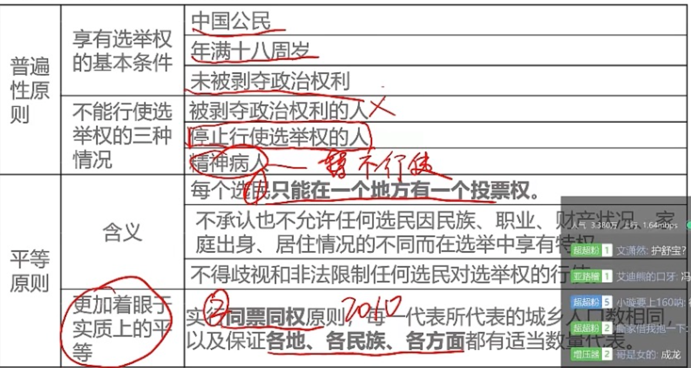
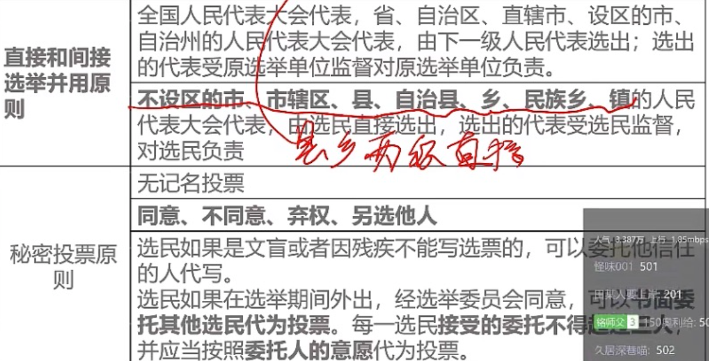
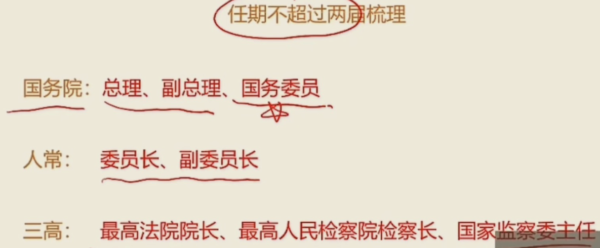
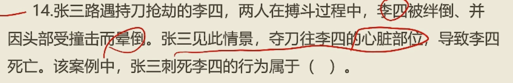
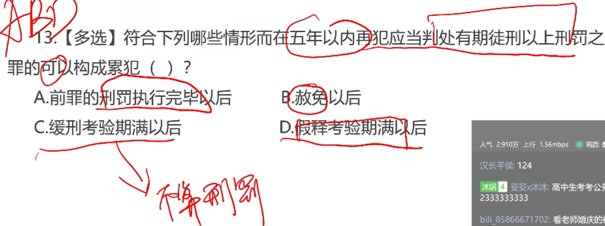

## 宪法

国旗，国歌，国徽，首都

法律效力和一般条文相同

我国宪法无附则

在资本主义国家中，英国是最早实行宪政的国家

#### 世界上第一部成文宪法一一1787年美国宪法

世界上第一部社会主义宪法—1918年《苏俄宪法》

旧中国:《中华民国临时药法》是中国历史上**惟一的一部资产阶级共和国性质的宪法性文件**。

新中国：一个宪法性文件：**《中国人民政治协商会议共同纲领》**，1949年起到**临时宪法**的作用

四部宪法：1954年宪法（**第一部社会主义性质的宪法**）、1975年宪法，1978年宪法，1982年宪法（现行宪法），对现在的宪法有五次修改

2018宪法修正了

1. “在马克思列宁主义、毛泽东思想、邓小平理论、‘三个代表’重要思想、**科学发展观、习近平新时代中国特色社会主义思想**指引下”
2. 在“自力更生，艰苦奋斗”前增写“贯彻新发展理念”；
3. 把我国建设称为**富强民主文明和谐美丽**的社会主义现代化强国，实现中华民族伟大复兴
4. 在长期的革命，建设，**改革**过程中
5. 全体社会主义劳动者，社会主义事业的建设者，拥护社会主义的爱国者，拥护祖国统一和**致力于中华民族伟大复兴的爱国者**
6. “**平等团结互助和谐**的社会主义民族关系已经确立，并将继续加强。”
7. 中国革命，建设，**改革**的成就...
8. ...平等互利、和平共处的五项原则，**坚持和平发展道路，坚持互利共赢开放战略**，发展同各国的外交关系和经济、文化交流，**推动构建人类命运共同体**；坚持反对帝国主义、霸权主义、殖民主义，...
9. 社会主义制度是中华人民共和国的根本制度，**中国共产党领导是中国特色社会主义最本质的特征**。禁止任何组织或者个人破坏社会主义制度。
10. 维护和发展各民族的**平等团结互助和谐**关系
11. 国家倡导社会主义核心价值观，提倡爱国，爱人民，爱劳动，...

宪法宣誓仪式：根据情况，可以采敢**单独宣誓或者集体宣誓**的形式。宣誓场所应当庄重、严肃，悬挂中华人民共和国国旗或者国徽。宣誓仪式应当**奏唱中华人民共和国国歌。**

国体即国家性质我国宪法规定：中华人民共和国是**工人阶级**领导的，以**工农联盟为基础**的**人民民主专政**的社会主义国家。公民范围大包括人民（和敌人）

1.中国共产党领导的多党合作制度

（1）**多党合作不是多党制**，**共产党是执政党**，民主党派不是在野党，而是**参政党**。

（2） 坚持中国共产党的领导、坚持四项基本原则是多党合作的**政治基础**

（3）“长期共存、互相监督、肝胆相照、荣辱与共”是多党合作的**基本方针**

（4）共产党对民主党派的领导是**政治领导**，即政治原则、政治方向和重大方针政策的领导。

现代国家的主要类型分为单一国、复合国。复合国目前有联邦和邦联两种形式

四项基本原则：一、必须坚持社会主义道路；二、必须坚持人民民主专政；三、必须坚持共产党的领导；四、必须坚持马列主义、毛泽东思想。

**八大民主党派**：中国国民党革命委员会，中国农工民主党，中国民主同盟，中国致公党，中国民主建国会，九三学社，中国民主促进会，台湾民主自治同盟

**中国人民政治协商会议**——爱国统一战线组织形式**

**政协职务/任务**——**政治协商，民主监督，参政议政**

**我国政体、国家的根本政治制度——人民代表大会制度**

### 民族区域自治制度

自治区，州，县，民族乡不是

自治区，州，县的人民代表大会和人民政府属于自治机关；

经国务院批准自治机关可组织**公安部队；（军队不行）**

自治权——制定自治条例和单行条例权——**自治区人大制定自治条例和单行条例**

### 基层群众自治组织

基层群众自治组织包括**村委会与居委会**，二者**不属于国家机构**，基层政府指导，支持，帮助，

村民委员会的性质——**基层群众性自治组织**

群众性自治组织的**任期5年**

## 选举制度

我国实行直接选举的范围包括

县乡两级的直接选出，双过半原则（＞50%）

1. 不设区的市和市辖区的人民代表大会代表

2. 县、自治县的人民代表大会代表

3. 乡、民族乡、镇的人民代表大会代表
4. 设区的市的人民代表大会代表不行，属于市，要间接选出

我国农村和城市每一名全国人大代表的人口数比例1:1

## 公民基本权利

**平等权**，司法平等，守法平等

**政治权利自由**，选举权和被选举权，既是公民的最基本的民主权利，是公民参与管理国家和社会的基础和标志，**政治自由，包括言论出版、集会、结社、游行、示威的自由，没有罢工**（可以被剥夺）

**监督权**，监督权包括批评、建议权，控告、检举、申诉权

**取得赔偿权**

**生命权**

**人身自由权**

人格尊严不受侵犯

公民的住宅权不受侵犯。禁止非法搜查或者非法侵入公民的住宅。

通信自由和通信秘密。除因国家安全或者追查刑事犯罪的需要，由公安机关或检察机关依照法律规定，

**受教育权和劳动权，既是权利又是义务，只有劳动者有休息的权利（休息权），没有带薪休假的权利**

获得物质帮助权公民在年老、疾病或者丧失劳动能力的情况下**（自然灾害不行）**，有从国家和社会获得物质帮助的权利。

文化权利和自由。公民有进行科学研究，文学艺术创作和其他文化活动的自由，**没有出版权**，被剥夺政治权利的公民不再享有出版著作的自由

被剥夺政治权利的公民**享有**科学研究的自由，被剥夺政治权利的公民**享有**艺术创作的自由，**被剥夺政治权利的公民享有宗教信仰的自由**

## 全国人大

1. **修改宪法**，**监督宪法的实施**，
3. **制定和修改基本法律**
4. **选举主席和副主席**，
5. 主席**提名**，决定**国务院总理**；
6. **国务院总理**提名，决定国务院副总理、国务委员、**各部部长**、各委员会主任，
7. 选举中央军事委员会主席；
8. 选举最高人民法院院长
9. 选举最高人民检察院检察长
10. 选举国家监察委员会主任
11. **审查和批准**国民经济和社会发展计划和**计划执行情况的报告**
12. **审查和批准国家的预算和预算**执行情况的报告
13. **改变或者撤销全国人民代表大会常务委员会**不适当的决定
14. 批准**省、自治区和直辖市**的建置（乡和乡村归省政府管，中间的全部给国务院管）
15. 决定**特别行政区**的设立及其制度
16. **决定战争和和平的问题**
17. 应当由最高国家权力机关行使的其他职权

## 全国人大常务委员会

**全国人大常委会**是全国人民代表大会的**常设机关**，在**闭会期间行使最高国家权力的机关**。全国人大常委会与全国人大是隶属关系

常委会的组成人员不得担任**国家行政机关、监察机关、审判机关和检察机关**的职务，**可以在军队担任职务**

人大代表可以担任上面的职务↑

全国人大常委会的任期与全国人大相同，即5年。

委员长、副委员长连续任职不得超过两届

1. **解释宪法，监督宪法的实施**。（人常和人大都可以）
2. **制定和修改基本法律**
3. 解释法律
4. **审查批准**国民经济发展计划和国家预算
5. **监督国务院**等工作
6. **撤销（不能改变）**宪法，法律的行政法规，决定和命令
7. **撤销（不能改变）**地方性法规和决议
8. **国务院总理提名**，**决定各部部长**，委员会主任等
9. **决定外国的条约**重要协定的**批准和废除**

## 权力机关

地方各级人民代表大会及常委会

县级以上人民代表大会设立常务委员会，都是任期五年；

**乡镇的人大不设人大常务**，任期五年

## 国家主席

年满45岁可以；

任期五年；

国家元首（包括主席和副主席）

**代表国家**，进行国事活动

**代美国家**，接受外国使节

根据**全国人大常委会的决定**，**宣布**批准或废除条约和重要协定

公布法律，**发布**命令

**发布**特救令、**宣布**进入紧急状态等

由国家主席**宣布**国务院总理，国务委员，各部部长等的任职或免职，

## 国务院

1. 根据宪法和法律，**规定行政措施，制定行政法规，发布决定和命令**
2. **改变或者撤销**各部、各各委员会发布的不适当的命令、指示等
3. **改变或者撤销**地方各级国家行政机关的不适当的决定和命令
4. 批准**省、自治区、直辖市**的区域划分，批准**自治州、县、自治县、市**的建置和区域划分
5. **领导管理国防建设事业，没有国防**
6. 决定省，自治区，直辖市的范围内部分地区进入紧急状态（如武汉疫情）
7. 领导管理....
8. **编制执行**国民经济和社会发展计划和国家预算

## 中央军事委员会

**是全国武装力量的最高领导机关**

中央军委每届任期同全国人大每届任期相同即为期5年，没有届数限制

中央军委实行主席负责制

## 人民法院

人民法院是我国的审判机关

全国设立最高人民法院、**地方各级人民法院**、专门人民法院。

领导体制——监督关系

四级两审终审制

## 司法机关

领导体制——双重从属制

**人民检察院**依法独立行使检察权，是**国家的法律监督机关**

**公安局属于行政机关**

## 监察委员会

最高监察机关

国际监察委员会主任连续任职不得超过两届

国家监察委员会**对人大和人大常务委员会负责**。

监察委员会依照法律规定**独立**行使监察权，不受行政机关、社会团体和个人干涉。

## 刑法

罪型法定原则（法无明文规定不为罪，法无明文规定不处罚）

刑法面前人人平等原则

罪责刑相适应原则（轻罪轻罚，重罪重罚）

**属地管辖原则（属地管辖权）**——凡在中华人民共和国领域内犯罪的（除了特别规定的以外），海陆空，驻外使领馆，船舶，飞机火车；行为地或是结果地，都适用刑法

保护管辖原则（保护管辖权）外国人对我国公民犯罪，

普遍管辖原则（普遍管辖权）（恐怖，贩毒，贩奴，特有的罪）

属人管辖原则（属人管辖权）人在外国犯罪，也要用刑法

### 刑法时间效力

从旧兼轻原则——优先轻再选旧

97——判处10年（x），判处5年（对），判处10年（x）

79——判处5年（对），判处10年（x），判处10年（对）

### 犯罪

特征——社会危害性、刑事违法性、应受惩罚性

任何一种犯罪的成立都必须具备四个方面的构成要件，**犯罪主体**，**犯罪主观方面**、**犯罪客体**和**犯罪客观方面**。

#### 单位犯罪

单位犯罪的主体包括公司、企业、事业单位、机关、团体

必须有为本单位谋取非法利益的故意，并且做出犯罪决定的是单位集体或其负责人

单位犯罪的，对单位判处罚金，**直接负责的主管人员**和其他**直接责任**人员判处刑罚（双罚制），不是直接负责人就不处罚法定代表人

双罚为主，单罚为辅；

单罚制：一般只处罚个人。

#### 自然人

**不满14岁**，实施任何行为，**不构成犯罪**

14周岁——16周岁的人，**故意**杀人、故意伤害致人重伤或者死亡、强奸、抢劫、贩卖毒品、放火、爆炸、投毒，投放危险物质的，负刑事责任。

**但是，过失杀人，绑架，不是故意杀死人，盗窃，种植毒品，走私毒品，吸毒，偷渡，都不负刑事责任**

14-18岁，从轻减轻处罚；不满16不负刑事责任的，必要的时候可以由政府教养；，已满75岁的，不适用死刑；故意犯罪，可以从轻处罚；过失，要从轻处罚；

**精神病，完全不能控制自己或不能辨认的，不负刑事责任；**

间歇性的正常的时候犯罪，要负刑事责任；

没有完全丧失辨认或控制自己行为的精神病人，又聋又哑的人或者盲人犯罪，负刑事责任，可以从轻处罚；

醉酒的人，负刑事责任，不加刑不减刑；

又聋又哑的人或者盲人犯罪，负刑事责任，可以从轻或免除处罚；

14-18，75以上老人过失犯罪，从轻、减轻处罚；

75以上老人故意犯罪，半疯，可以从轻、减轻处罚；

#### 犯罪主观方面

犯罪目的达到了就是犯罪既遂；没达到就是犯罪未遂；

以下情况不属于共同犯罪

1. 共同**过失犯罪**行为
2. .一有故意，**一方过失的犯罪**行为
3. 实施犯罪时**故意内容不同**
4. 同时犯偶遇
5. 超出共同故意之外的犯罪
6. 事前无通谋的事后帮助行为
7. 间接正犯；让一个不知情的人去做

交通肇事，附近所有人**指使肇事人逃逸**，得不到求助死亡的，是共犯；

从犯要从轻处罚

### 刑罚

主刑，附加刑；

主刑不能附加适用；一个罪一个主刑，不能有两个以上的主刑；

没有剥夺政治权利的犯罪分子，可以行使选举权等政治权利

管制——**限制3月以上2年以下，数罪并罚不能超过3年**；**限制自由**；**社区矫正机关**；不是关押；关押折抵1:2（可以和拘役和有期徒刑折抵）；

拘役——参加劳动可以发报酬，每月回家1-2天；**限制1个月以上6个月以下，数罪并罚不能超过1年**；**剥夺自由**；**公安机关（看守所）**；就近关押；关押折抵1:2（可以和拘役和有期徒刑折抵）；最低减刑不能少于一半

有期徒刑——强制劳动改造，**6个月以上，15年以下**，刑期总和**不满35年的，最高不超过20年**；刑期总和**超过35年的，最高不超过25年**；剥夺自由；剩余3个月以下的，看守所代执行；未成年犯在犯管教所执行刑罚；是关押；关押折抵1:1（可以和有期徒刑折抵）；**可以假释**；最低减刑不能少于一半

无期徒刑——强制劳动改造，**可以假释；**剥夺自由；是关押；最低减刑不能少于13年

死刑——无偿劳动，死缓立功2年期满后=》25年有期徒刑；死刑立即执行的=》剥夺生命，在法院执行；是关押；

#### 死刑立即执行

未满18岁的（17岁犯罪，19岁被抓，不能被执行死刑；

怀孕的妇女（关押到执行的过程中，流产，坐月子，都不能被执行死刑；

年满75岁人（特别情况除外；74岁犯罪，75岁被抓，不能被执行死刑；

立即执行=》最高人民法院判决核准；**死刑缓期两年执行的=》高级人民法院核准**；

没有故意犯罪的两年满后=》减为无期徒刑；死缓立功2年期满后=》25年有期徒刑

附加刑（从刑），可以独立适用，可以附加适用

罚金（不等于罚款，罚款是行政处罚），剥夺政治权利，没收财产，外国人驱逐出境

### 剥夺政治权利

主要涉及以下权利：

选举权和被选举权；

言论、出版（可以创作）、集会、结社游行、示威的权利，迫任国家机关职务的权利;

任国有公司、企业、事业单位和人民团体**领导**职务的权利。

**危害国家安全的，死刑，无期徒刑，必须剥夺政治权利**；其他可以剥夺；

有期徒刑，拘役=》剥夺期限1-5年；

死刑，无期徒刑减为无期徒刑的=》3-10年；

管制=》3月以上-2年以下，不超过3年；

### 累犯

一般累犯：

5年内，前罪与后罪都**必须是故意犯罪**。

犯前罪时必须**年满18周岁**

前罪被判处**有期徒刑以上**刑罚，后罪应当判处**有期徒刑以上**刑罚。

累犯应当从重处罚，**不得缓刑**和假释；可以减刑；

特殊累犯：

不受时间限制，前罪后罪都是危害国家安全，恐怖活动，黑社会组织的犯罪；

在假释考验期内再犯新罪的，不是累犯

### 自首

一般自首——犯罪以后自动投案（未被司法机关发现），向**公安机关，人民检察院或者人民法院(没有监察局)**投案；亲友劝去也算；犯罪嫌疑人自动投案后又逃跑的不能认定为自首；一审前

特别自首——如实供述司法机关**尚未掌握**的本人**其他罪行（其他种类的罪行）**的行为；**如果是被抓了**，**供述了之前相同类型的罪行的行为，是坦白，不属于自首**

### 缓刑

死缓不是缓刑；

拘役（2月以上1年以下考验期）或3年以下有期徒刑（1年以上5年以下考验期）的，没有管制；

未成年，已满75岁的人，孕妇妇女，犯罪轻的，要缓刑；累犯，犯罪集团首要分子——不能缓刑

限制加重原则——针对判处有期徒刑、拘役和管制的，应当在总和刑期以下，**数刑中最高刑期以上**，酌情决定执行的刑期，并规定执行刑期的最高限度。

比如8年和12年的罪，要判处12年以上；

**附加刑仍需执行**；有有期徒刑，拘役，管制的，有期徒刑和拘役执行完，**管制仍需执行**

**缓刑期满后，重新犯罪的，不算累犯**

### 减刑

**执行机关**向**中级以上人民法院**提出减刑建议书

### 假释

执行原判刑期一半以上，才能假释

累犯，以及因故意杀人、强奸，抢劫、绑架、放火、爆炸，投放危险物品或有组织的**暴力性犯罪**且被**判处10年以上或无期徒刑**的，**减刑**的，不能假释；

### 立功

主动揭发

### 追诉

从犯罪之日开始计算

不再追诉的——不满5年有期徒刑的，超过5年；五年以上不满十年有期徒刑的，经过十年;十年以上，经过十五年；无期徒刑死刑的，经过二十年，二十年后必须追诉的，到最高人民检察院核准； 

如果立案侦查或受理案件了，就不受追诉期限限制；

追诉期内又犯罪的，从后面犯罪的日子开始重新计算

