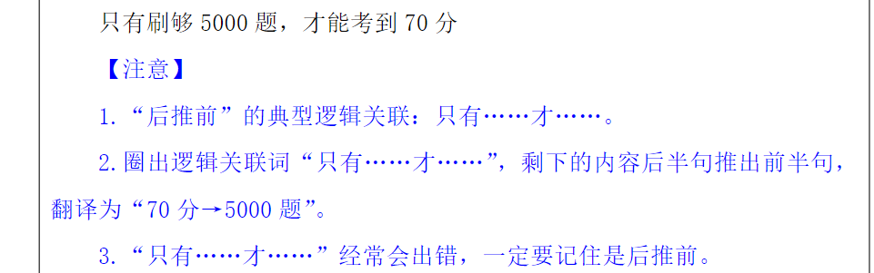

反对关系：在一个领域中，非此即彼为矛盾关系，情况有很多（A、B、·）

交叉关系：有公共地带，也有自己独有的部分

种属关系：如果能造句“A是B”，则A和B是种属关系

“交叉关系”造句：有的A是B，有的A不是B；有的B是A，有的B不是A。

二者为并列关系：A项：“木门”和“铁门”是两种不同的门，没有公共部分，

如果A就B，等价于 —B=》—A

**只有** **A才B******等价于 B=》A****

除非A否则B 等价于 **—B=》A** 即 **—A=》B**

除非A否则不B 等价于 **B=》A** 即 **—A=》—B**

A是B的前提、关键，等价于 **B=》A**

**A的前提是B，等价于A=》B**

