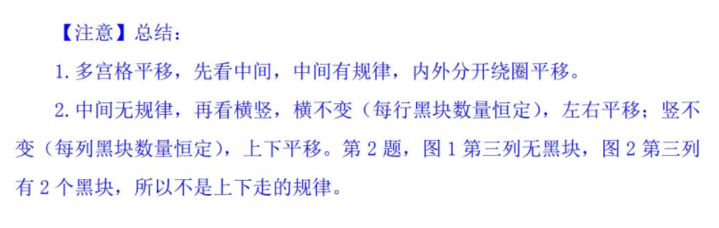
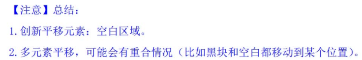
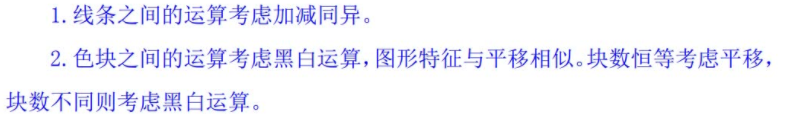
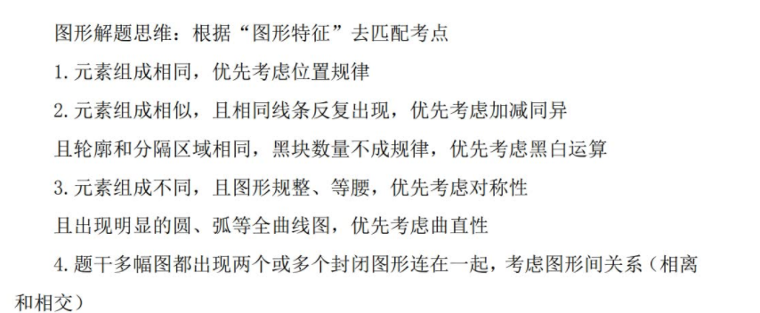
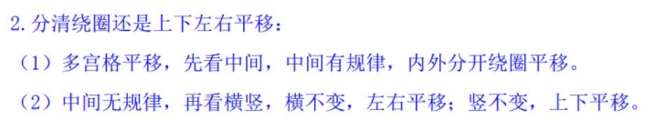
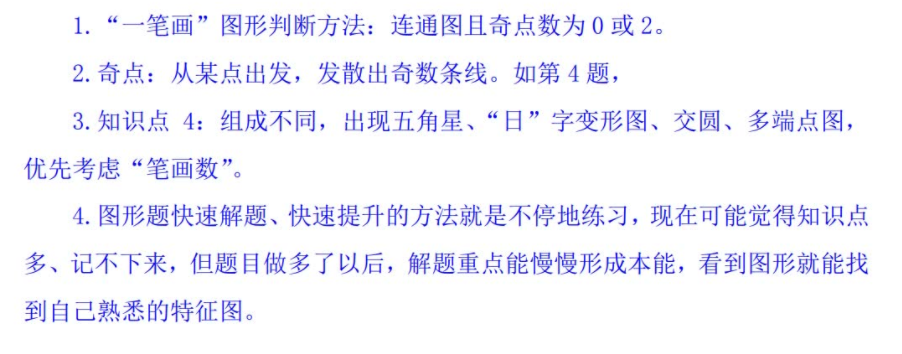
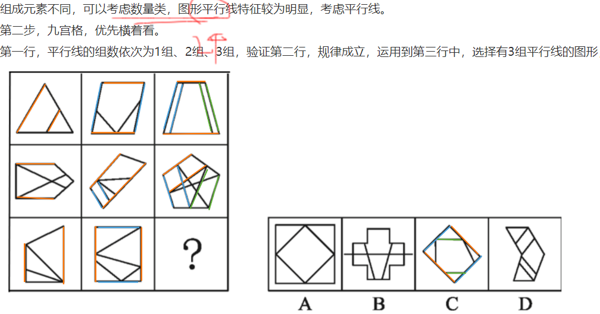
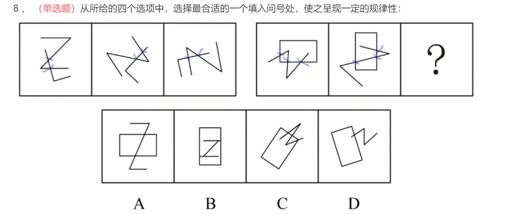

看曲直(字母也是，也要看曲线加直线推的第三种图的规律，也要看是否相交，相切的规律，每幅图都存在相切，考虑数切点，也要看曲线直线的数量的关系规律，

看图形是否封闭，垂直明显看直角个数，锐角明显看锐角个数

出现小元素，考虑元素的种类、个数

相同线条反复出现，考虑加减同异

找交点

找笔画 题干图形出现一坨线闭合相连的图形，考虑笔画数。

找对称轴,(也要注意单独拆分，比如找白色、五边形等对称,也要注意

多个图是否符合规律，对称 不对称 对称 不对称  对称

找共同属性,有三角形 有圆形

找边数和内部点数（之差）

每幅图形中横线和竖线的数量均相等，每幅图形均有一个封闭空间，

找相同的面,(做归纳

找封闭面

找开闭性

找最大面

将黑点进行连线，连线后线条的夹角角度均为90°和135°

图1和图2**定义叠加后旋转180°**得到图3，叠加规律为：黑+黑=白，白+白=白，黑+白=黑，白+黑=黑

题干和选项中均出现了**圆相切，考虑一笔画。******且都有圆****======》***且都有圆***或是均含有矩形，所以问号处也应填入一个可一笔画出且都有圆或含有矩形的图形

**对称轴穿过n个面**

，对称轴左右两边**皆出现相离的两个封闭图形**

组成元素凌乱，优先考虑属性类或数量类，第n,n+1,n+2个字母含有曲线

组成元素不同，优先考虑数量类或属性类，线条的特征比较明显，考虑数线，

或是平行线组数

组成元素不同，优先考虑数量类或属性类。图形出现十字交点，考虑数点

图形组成不同，且有明显黑白块分布，优先考虑面。
第二步，一条式，从左到右找规律。
从左到右观察，每幅图黑色和白色各自占总面积的1/n

九宫格，横向规律较为常见，优先考虑。
十六宫格通常可以划分为外圈区域和中心田字格两部分

九宫格，横向观察，没有明显规律，考虑竖向规律。图形均有n条对称轴

图①④⑤中点减去面的差为3，图②③⑥中点减去面的差为2，依此规律分为两组。点面差

顺序性较为明显，优先考虑字母顺序,中间间隔几个个字母；

图推每一个图形中横线数量和竖线数量均相等；
