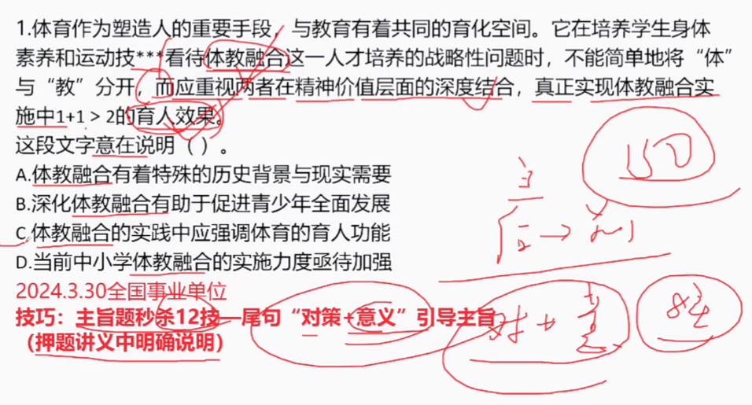
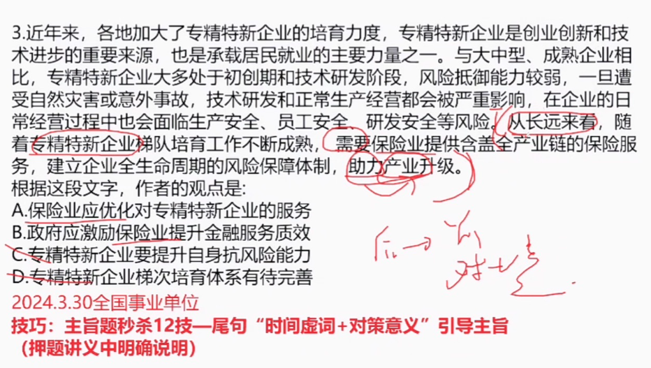
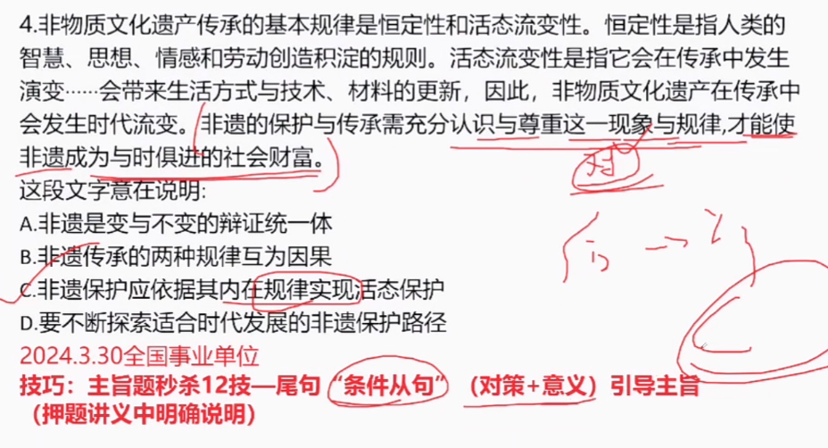

北极星”又称北辰、紫微星，指的是最靠近北天极的一颗恒星，“北斗星”是由天枢、天璇、天玑、天权、玉衡、开阳、瑶光七星组成

“**出神”**指因精神过度集中而发呆，强调神态格外专注，到了发呆的地步，**“入神”**指对眼前的事物发生浓厚的兴趣而注意力高度集中，强调注意力格外集中，到了入迷的地步，两词都可以形容人的心神专注，二者属于近义关系

**“出世”和“入世”**是两种不同的人生态度，“出世”指远离尘世凡俗，“入世”指进入尘世，二者属于反义关系

信仰”可以改善“空虚”的状况，二者属于对应关系，

“内核”指的是物体中像核的部分，借指主要内容、实质。“硬核”原形容说唱音乐有力量感或游戏有难度，后形容强悍、彪悍。“内核”决定事物是不是“硬核”，二者属于对应关系。

水波”指的是水的波浪，“秋波”本义是秋风中的湖波涟漪，比喻女人的眼睛，二者无明显逻辑关系，

“症结”原指中医指腹中结块的病，也比喻事情弄坏或不能解决的关键，“原因”是对事物所以如此的解释，二者无明显逻辑关系，

“声波”指发声体产生的振动在空气或其他物质中的传播，属于机械波，“光波”是一种电磁波，二者均能产生干涉和衍射现象，但无明显逻辑关系

**楮墨**”是纸和墨

凝聚：气体由稀变浓或变成液体。凝结”指气体遇冷而变成液体

**纾解**，指缓解了但还需要继续，“疏解”是完全解决；：这场及时雨，正好纾解了旱象

“转圜”，指挽回

修缮和修葺都指修理、修补，二者是近义关系,且缮，修，葺也为近义关系

履职指履行职务；履任指到任、就任，不是近义关系；

休闲和休憩都可指休息，二者是近义关系，且休、闲、憩也为近义关系

展现形势——展现态势

加强历练，过程有风险，....

“萌发”一般搭配“想法”，，与“难民营”搭配不当，可以和“催生”，指促使产生，

# 1

