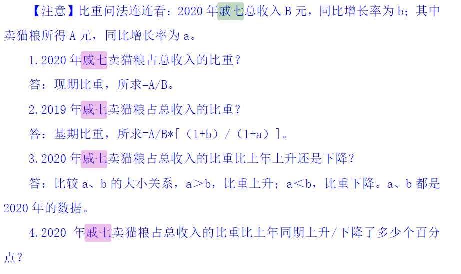
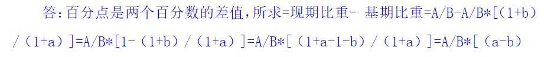
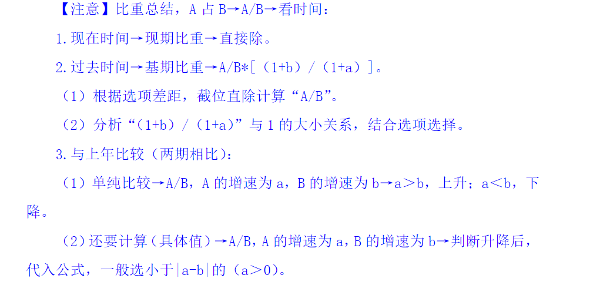
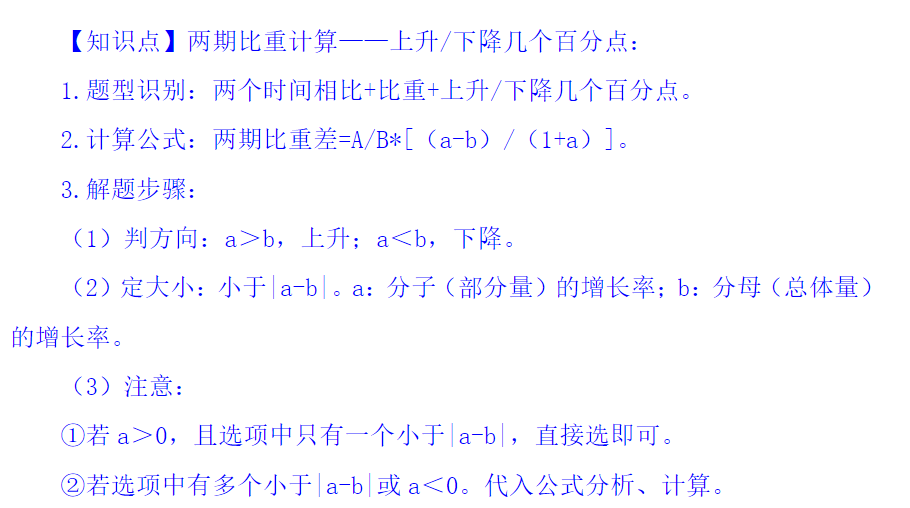
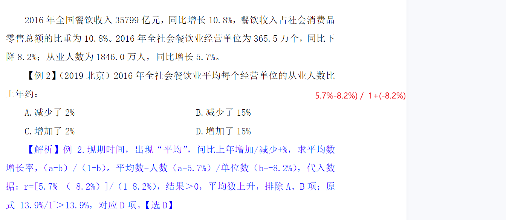
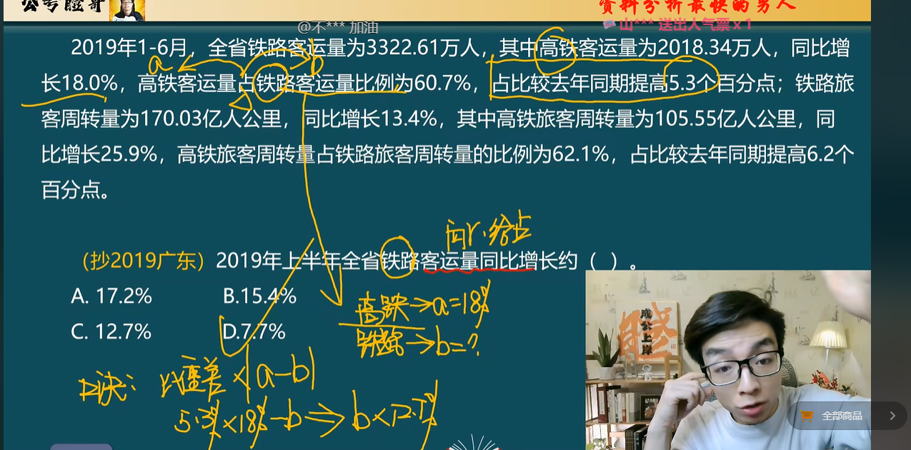

**基期比重，所求=A/B*[（1+b）/（1+a）]。**比如上一年的A占总收入B的比重？

##     				  														--------------------A	（1+b）								（1+b）

## 基期比重 =    ——  *     —— =  A占B的n%	 *       —— 

## 					 														--------------------B	（1+a）								（1+a）

**两期比重差 ： A/B  * （a-b）/（1+a）**

##     						  							  								-----------------------A		（a - b）

## 两期比重差  =  ——	 * 	——

## 																						----------------------B		（1+a）

增长+%，为增长率的问法。增长率=增长量/基期量，其中增长量=A/B*
[（a-b）/（1+a）]，基期量=A/B*[（1+b）/（1+a）]，故 r=增长量/基期量={A
/B*[（a-b）/（1+a）]}÷{A/B*[（1+b）/（1+a）]}=（a-b）/（1+b）。

出现“平均”，问比上年增加/减少+%，

**平均数增长率 r=（a-b）/（1+b）**，识别：平均/每/单位+增长+%

##     						  									  										---------------------------（a - b）

## 平均数的增长率= 		——

## 																										----------------------------（1+a）

**平均数的增长量=A/B*[（a-b）/（1+a）]，**识别：平均/每/单位+增长+具体单位。

##     						  									  										----------------------------A		（a - b）

## 平均数的增长量  =  ——	 * 	——

## 																										----------------------------B		（1+a）

2020 年比 2019 年收入增长率为 r1，2019 年比 2018 年收入增长率为 r2。问：2020 年比 2018 年收入增长率是多少？

可以推出：

##  r 间=r1+r2+r1*r2。 r2 = （r间 - r1）/（1 + r1）

##     						  							  			--------（r间 - r1）

## 					 r2 =   	————

## 																	---------（1 + r1）

##     						

## △=n现 - n前 = n现/（1 / 率 ± 1）

##     						  										 																				-----------------------------------------n现

## △	=n现 - n前 	=  	————————————

## 																										----------------------------(1 / 增长、减小率   ±    1）

## n年的率

##     						  																-----------------------A现在

## （1 + r）**n  =  ————

## 													 	 								----------------------Bn年前

